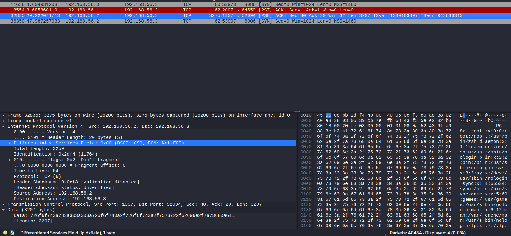
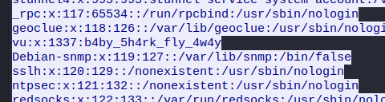

# Blue Baby Shark
> Hello Stranger!

> I got recomendation from one of our common acquaintance. I’m a new into all of this CTF stuff. I got stuck with one challange and I’m not that skilled wit the network traffic analysis. Would you be able to help me out with this partiucalr CTF and find the flag? Only hint I have so far is that one machine was compromised.

## About the Challenge
We were given a pcapng file and we need to find the flag there (You can find the file [here](Blue%20Baby%20Shark.pcapng))

## How to Solve?
I open the file using `Wireshark` and using `frame contains "vu"` filters to find the packet that contains `vu` string. And then there are 4 packets that contains `vu` string.



I press the `Follow TCP` on packet 32835 and we will find the flag on `vu` user



```
VU{b4by_5h4rk_fly_4w4y}
```