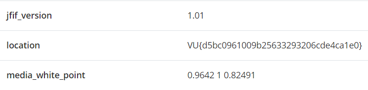

# Find location
> Find the flag in the photo location

## About the Challenge
We have been a given a photo and we need to find the flag there (You can get the picture [here](Location.jpeg))

## How to Solve?
Check the metadata to get the flag



```
VU{d5bc0961009b25633293206cde4ca1e0}
```