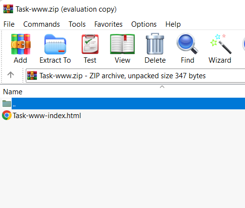
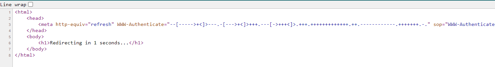

# Simple Web
> It consists of only eight commands, each represented by a single character, and uses a tape-based memory model with a pointer. However, it is considered difficult to write programs in, as it provides very little abstraction over the machine model and requires one to break problems down into very simple steps.

## About the Challenge
We are given a zip code that contain HTML file inside of it



## How to Solve?
If we open the HTML file and check the source code, you will found `brainfuck` language



And if you decode it, you will get the flag

```
cyberthon
```