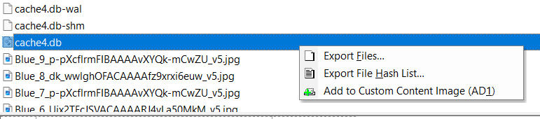
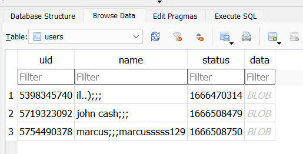

# What is the name of the username telegram
> What is the name of the username telegram?

## About the Challenge
We need to find the name of the username telegram

## How to Solve?
Go to `root/data/org.telegram.mesengger.web/files` (Don't check `org.telegram.mesengger`). And then extract `cache4.db` SQLite database



Open the database file using `DB Browser for SQLite` software and then find `users` table and you will find the `uid`



```
5719323092
```