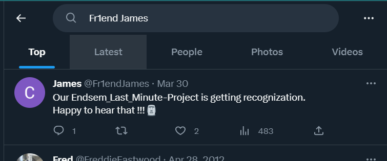
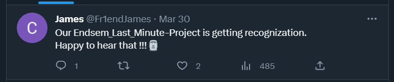
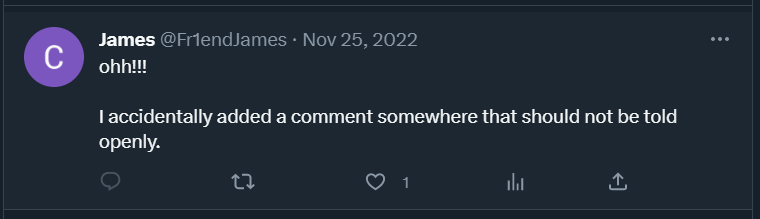
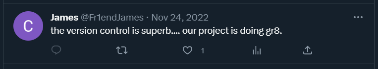
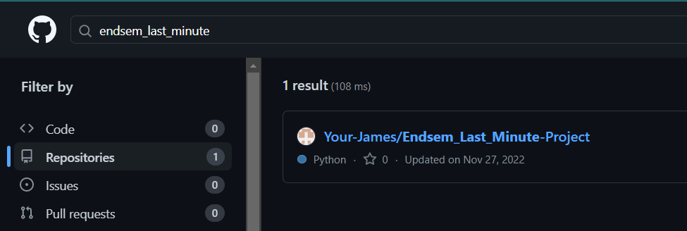
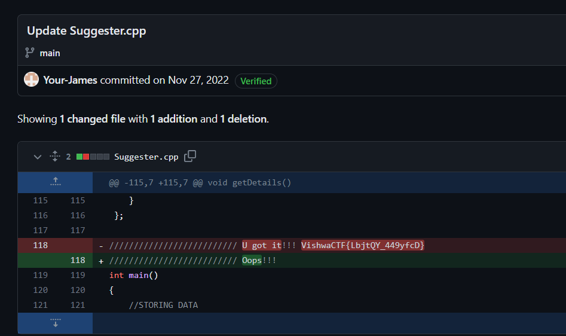

# Fr1endship Forever
> This is going to be a double hunt...

> My childhood Fr1end James has posted something about the project he made on his socials (just to flaunt). Today is our submission day and my Fr1end James is absent. Yesterday when we met him, he told me, "Mark can you submit my project also with yours, as I will be going out of the city tomorrow morning." He forgot to tell me anything about his project. He is not even picking up my phone.

> Help me find him and of course his project.

## About the Challenge
We need to find james account first to get more hints

## How to Solve?
When I tried to find in some social media (Twitter, LinkedIn, etc.) using `Fr1end James` keyword. I've found an account which I believe this account related to the chall



When I tried to stalk that account, I've got more hints





I belive the flag was located in GitHub and inside the comment. And then the repository is related to `endsem_last_minute`. I decided to search the repository first in GitHub using `endsem_last_minute` keyword



Open that repository and go to commit history. Find a commit with `Update Suggester.cpp` title to obtain the flag



```
VishwaCTF{LbjtQY_449yfcD}
```