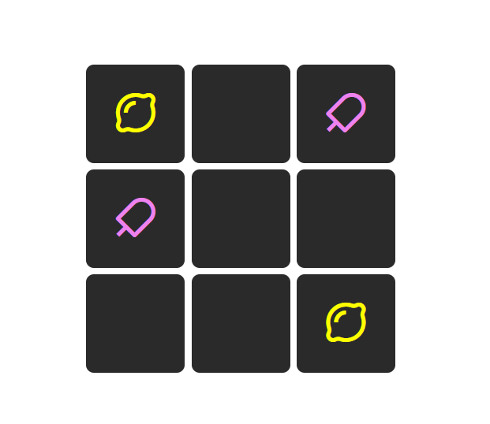
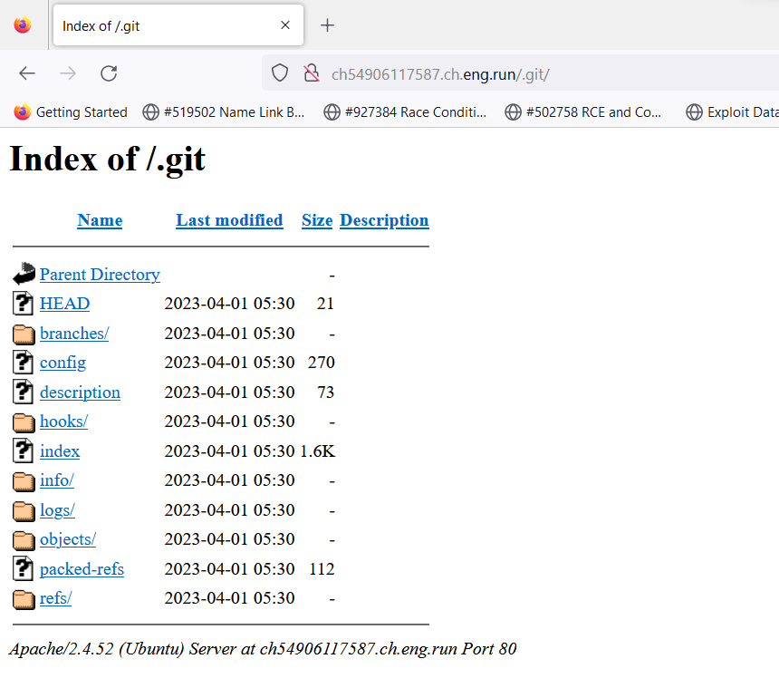
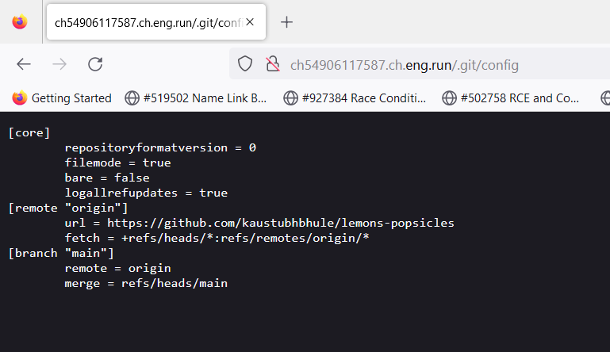
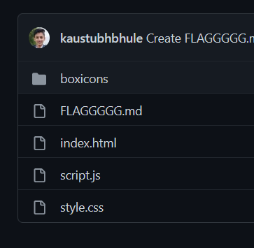
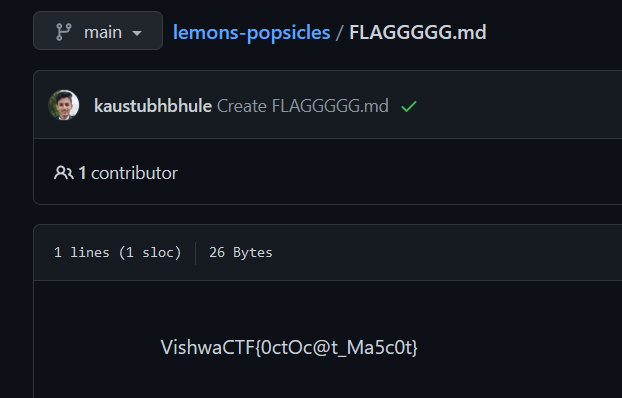

# Mascot
> Very gracious host!!

## About the Challenge
We were given a website where we can play tic-tac-toe games.



## How to Solve?
When I want to check the source code, trying to win the game. The result is nothing. And then I decided to test some interesting endpoint like `.git` or `robots.txt`. And then there is `.git` folder exposed.



After checking the `config` file, we will see a GitHub repository.



Check the repository, we will see a file called `FLAGGGGG.md`. Open that file to obtain the flag





```
VishwaCTF{0ctOc@t_Ma5c0t}
```