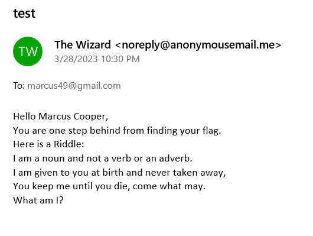
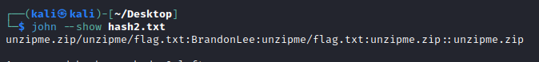

# The Sender Conundrum
> Marcus Got a Mysterious mail promising a flag if he could crack the password to the file.

## About the Challenge
We were given an email file (You can download the file [here](TheEmail.eml)) and a password protected zip file (You can download the file [here](unzipme.zip)). We need to know the password of the zip to obtain the flag




## How to Solve?
As you can see there is a riddle inside the email, solve it to get the flag. But in this case I will brute the zip file using `JohnTheRipper`. Here is the command I used

```
zip2john unzipme.zip > hash.txt
john -w=/usr/share/wordlists/rockyou.txt hash.txt
```

And then check the password by running this command
```
john --show hash.txt
```



The password is `BrandonLee`. Open the zip file again and input the password to read the flag

```
vishwaCTF{1d3n7i7y_7h3f7_is_n0t_4_j0k3}
```