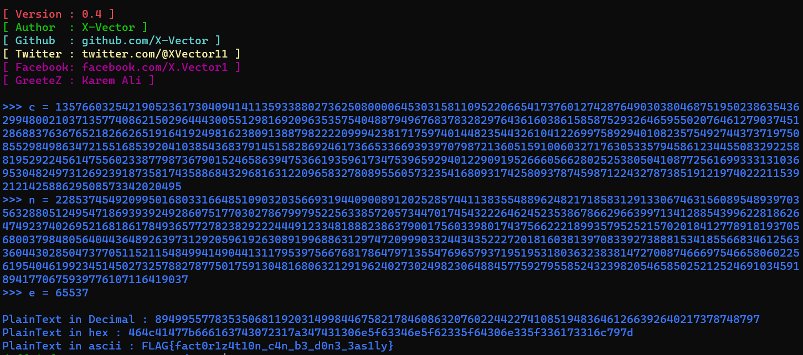

# EZDORSA_Lv3
> The power of mathematics is staggering!

## About the Challenge
We were given a zip file (You can download the file [here](cry-EZDORSA-Lv3.zip)). There are 2 files inside the zip file, `chall.py` and `out.txt`. Here is the content of `chall.py`

```python
from Crypto.Util.number import *

e = 65537

n = 1
prime_list = []
while len(prime_list) < 100:
    p = getPrime(25)
    if not (p in prime_list):
        prime_list.append(p)

for i in prime_list:
    n *= i

m = b"FAKE{DUMMY_FLAG}"
c = pow(bytes_to_long(m), e, n)

print(f"n = {n}")
print(f"e = {e}")
print(f"c = {c}")
```

The given Python code generates a 100-digit RSA public key with exponent e=65537 and modulus n, which is the product of 100 randomly generated 25-bit prime numbers. A message m="FAKE{DUMMY_FLAG}" is encrypted using the RSA encryption algorithm and the resulting ciphertext c is printed along with the public key parameters. The code demonstrates how RSA encryption can be used to securely transmit messages over an insecure communication channel, where only the intended recipient who possesses the private key can decrypt and recover the original message.

And here is the content of `out.txt`

```
n = 22853745492099501680331664851090320356693194409008912025285744113835548896248217185831291330674631560895489397035632880512495471869393924928607517703027867997952256338572057344701745432226462452353867866296639971341288543996228186264749237402695216818617849365772782382922244491233481888238637900175603398017437566222189935795252157020184127789181937056800379848056404436489263973129205961926308919968863129747209990332443435222720181603813970833927388815341855668346125633604430285047377051152115484994149044131179539756676817864797135547696579371951953180363238381472700874666975466580602256195404619923451450273257882787750175913048168063212919624027302498230648845775927955852432398205465850252125246910345918941770675939776107116419037
e = 65537
c = 1357660325421905236173040941411359338802736250800006453031581109522066541737601274287649030380468751950238635436299480021037135774086215029644430055129816920963535754048879496768378328297643616038615858752932646595502076461279037451286883763676521826626519164192498162380913887982222099942381717597401448235443261041226997589294010823575492744373719750855298498634721551685392041038543683791451582869246173665336693939707987213605159100603271763053357945861234455083292258819529224561475560233877987367901524658639475366193596173475396592940122909195266605662802525380504108772561699333131036953048249731269239187358174358868432968163122096583278089556057323541680931742580937874598712243278738519121974022211539212142588629508573342020495
```

## How to Solve?
To solve this chall, im using this [tool](https://github.com/X-Vector/X-RSA) and then choose `Multi Prime Number`



```
FLAG{fact0r1z4t10n_c4n_b3_d0n3_3as1ly}
```