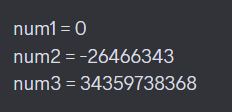

# int_generator
> There is a machine that takes any integer between 0 and 2**35 (inclusive) and returns a 16-digit integer.
What are flag1, flag2, and flag3?

> FLAG format：FLAG{flag1_flag2_flag3}

## About the Challenge
We were given a zip file (You can download the file [here](mis-int-generator.zip)). There are 2 files inside the zip file, `chall.py` and `output.txt`. Here is the content of `chall.py`

```python
import random

k = 36
maxlength = 16


def f(x, cnt):
    cnt += 1
    r = 2**k
    if x == 0 or x == r:
        return -x, cnt
    if x * x % r != 0:
        return -x, cnt
    else:
        return -x * (x - r) // r, cnt


def g(x):
    ret = x * 2 + x // 3 * 10 - x // 5 * 10 + x // 7 * 10
    ret = ret - ret % 2 + 1
    return ret, x // 100 % 100


def digit(x):
    cnt = 0
    while x > 0:
        cnt += 1
        x //= 10
    return cnt


def pad(x, cnt):
    minus = False
    if x < 0:
        minus = True
        x, cnt = g(-x)
    sub = maxlength - digit(x)
    ret = x
    for i in range(sub - digit(cnt)):
        ret *= 10
        if minus:
            ret += pow(x % 10, x % 10 * i, 10)
        else:
            ret += pow(i % 10 - i % 2, i % 10 - i % 2 + 1, 10)
    ret += cnt * 10 ** (maxlength - digit(cnt))
    return ret


def int_generator(x):
    ret = -x
    x_, cnt = f(x, 0)
    while x_ > 0:
        ret = x_
        x_, cnt = f(x_, cnt)
    return pad(ret, cnt)


num1 = random.randint(0, 2 ** (k - 1))
num2 = random.randint(0, 2 ** (k - 1))
num3 = random.randint(0, 2 ** (k - 1))

print("int_generator(num1):{}".format(int_generator(num1)))
print("int_generator(num2):{}".format(int_generator(num2)))
print("int_generator(num3):{}".format(int_generator(num3)))
```

This code is a Python implementation of a complex integer generator function that takes an integer as input and returns a padded integer. The generator function involves multiple sub-functions that manipulate and transform the input integer in various ways, including checking for certain properties, performing arithmetic operations, and adding padding zeros to ensure that the output integer is of a fixed length. The code uses a combination of mathematical techniques and random number generation to generate unique, large, and complex integers. Overall, the code seems to be designed for some specific application that requires the generation of such integers.

And here is the content of `output.txt`

```
int_generator(flag1):1008844668800884
int_generator(flag2):2264663430088446
int_generator(flag3):6772814078400884
```

## How to Solve?
I solved this with one of the TCP1P players, `@kaelanalysis`. He already got the `flag1`, `flag2` and `flag3`. But because we can't input negative number, we need to find another way to get the value of `flag2`



To find the `flag2` im using bruteforce approach.

```python
for i in range(0, 2 ** (k - 1)):
    num2 = i

    print("int_generator(" + str(i) + "):{}".format(int_generator(num2)))
```

So this code will try every number from `0` to `2**35`. And here is the command I used to get `flag2`

```shell
python3 solve.py | grep 2264663430088446
```


```
FLAG{0_26476544_34359738368}
```