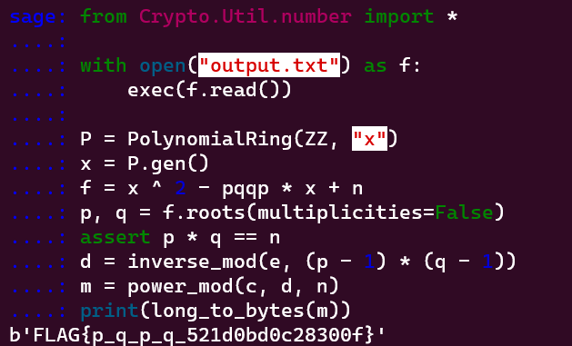

# pqqp
> ✨

## About the Challenge
We were given a zip file (You can download the file [here](cry-pqqp.zip)). There are 2 files inside the zip file, `chall.py` and `output.txt`. Here is the content of `chall.py`

```python
import os

from Crypto.Util.number import bytes_to_long, getPrime

flag = os.environb.get(b"FLAG", b"FAKE{THIS_IS_FAKE_FLAG}")

p = getPrime(1024)
q = getPrime(1024)
n = p * q
e = 0x10001
d = pow(e, -1, (p - 1) * (q - 1))

m = bytes_to_long(flag)
c = pow(m, e, n)
s = (pow(p, q, n) + pow(q, p, n)) % n

print(n)
print(e)
print(c)
print(s)
```

This Python script resembles the structure of many common cryptographic challenges, with the addition of a new variable called `s`. The script generates an RSA public-key encryption scheme with randomly generated primes `p` and `q` of length 1024 bits, and encrypts an input flag using RSA. The public key parameters `n` and `e`, as well as the ciphertext `c`, are outputted as usual. However, the script also calculates a signature s, which is obtained by computing the sum of the modular exponentiation of `p` raised to the power `q` and `q` raised to the power `p` modulo n.

And here is the content of `output.txt`

```
31091873146151684702346697466440613735531637654275447575291598179592628060572504006592135492973043411815280891993199034777719870850799089897168085047048378272819058803065113379019008507510986769455940142811531136852870338791250795366205893855348781371512284111378891370478371411301254489215000780458922500687478483283322613251724695102723186321742517119591901360757969517310504966575430365399690954997486594218980759733095291730584373437650522970915694757258900454543353223174171853107240771137143529755378972874283257666907453865488035224546093536708315002894545985583989999371144395769770808331516837626499129978673
65537
8684906481438508573968896111659984335865272165432265041057101157430256966786557751789191602935468100847192376663008622284826181320172683198164506759845864516469802014329598451852239038384416618987741292207766327548154266633297700915040296215377667970132408099403332011754465837054374292852328207923589678536677872566937644721634580238023851454550310188983635594839900790613037364784226067124711011860626624755116537552485825032787844602819348195953433376940798931002512240466327027245293290482539610349984475078766298749218537656506613924572126356742596543967759702604297374075452829941316449560673537151923549844071
352657755607663100038622776859029499529417617019439696287530095700910959137402713559381875825340037254723667371717152486958935653311880986170756144651263966436545612682410692937049160751729509952242950101025748701560375826993882594934424780117827552101647884709187711590428804826054603956840883672204048820926
```

## How to Solve?
This chall is literally same with `ImaginaryCTF: pqqp` (You can access the writeup [here](https://github.com/maple3142/My-CTF-Challenges/blob/master/ImaginaryCTF/Round%2026/pqqp/README.md))



```
FLAG{p_q_p_q_521d0bd0c28300f}
```