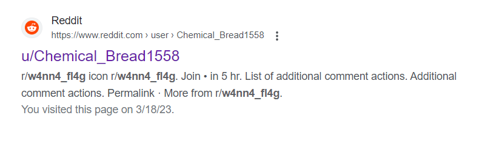
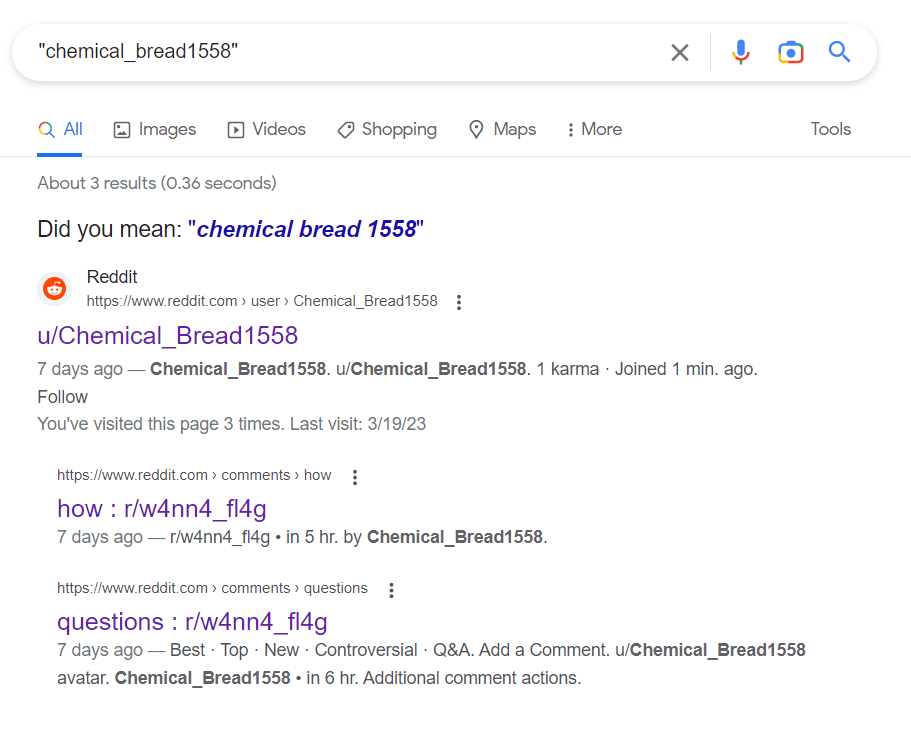
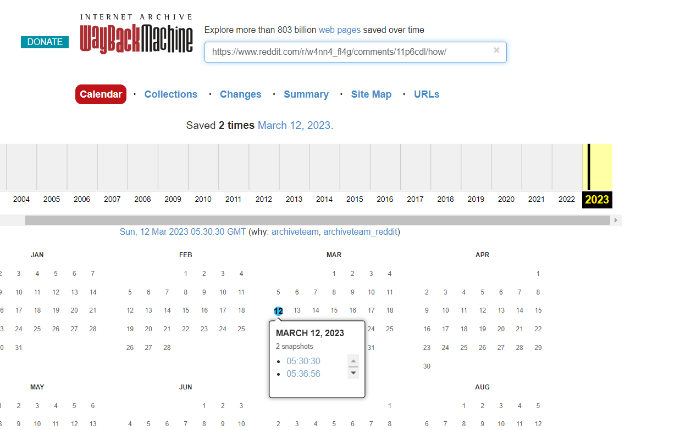
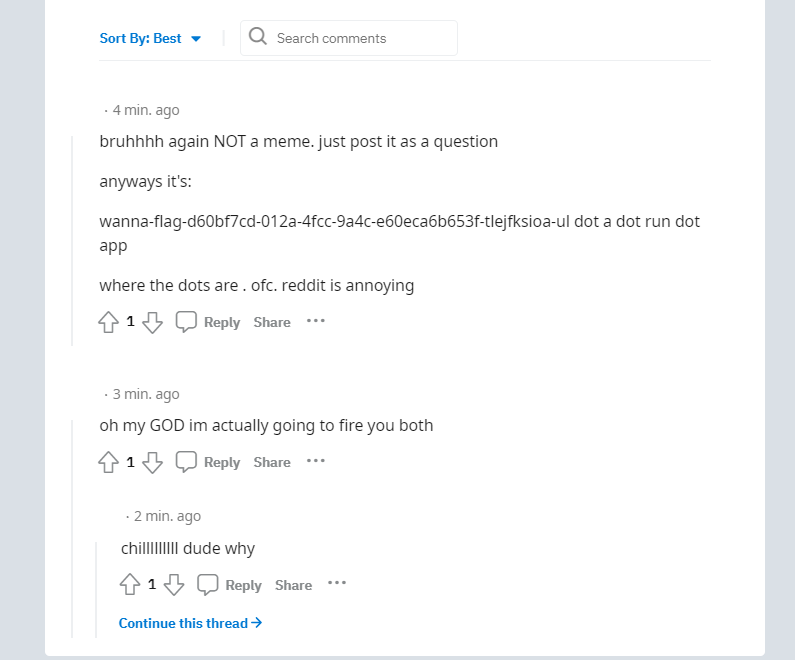
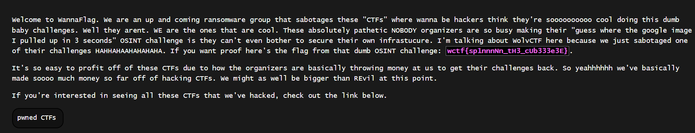

# WannaFlag III Infiltration
> We have some solid leads so far. However, we need our flags back. Find a way to locate their communication and infiltrate their private ransom service, and submit the stolen flag we wanted to use for the first OSINT!

> From outside intelligence, we know the group sometimes goes by w4nn4_fl4g

> Completion of this Challenge Unlocks:

> WannaFlag IV: Exfiltration

> WannaFlag V: The Mastermind

## About the Challenge
We need to find more information about `w4nn4_fl4g`

## How to Solve?
If you search on google using `w4nn4_fl4g` keyword, the result is:


Check the reddit page, and doing some OSINT. You will get some information:
* The moderator is https://www.reddit.com/user/w4nn4fl4g_admin/
* There are 6 posts on the page
* There are 2 users that already posts 7 days ago, 1 user has deleted their account and the other one is still active (https://www.reddit.com/user/RemarkableDiamond443/)

We will focus on the deleted user. If you check on the google search (Last result). You will see another user called `u/Chemical_Bread1558` and if you access their profile page, the account was deleted.



We know the deleted user username, now search it on google about that user



Check the [2nd result](https://www.reddit.com/r/w4nn4_fl4g/comments/11p6cdl/how/). As you can see that post was deleted. To recover the post, go to web.archive.org



There are 2 snapshots, choose the oldest one. And you will see a random website on the comment section



Access that website and you will get the flag



```
wctf{sp1nnnNn_tH3_cUb333e3E}
```