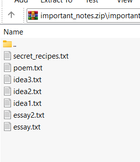
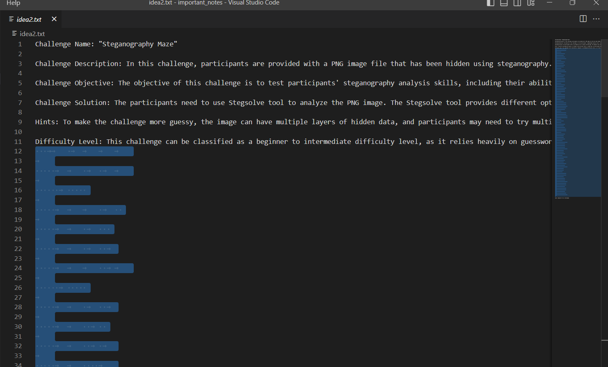
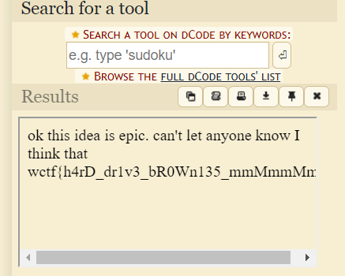

# important_notes
> idk im blanking on any lore for this challenge

## About the Challenge
We were given a zip file (You can download the file [here](important_notes.zip)), if we unzip the file we got 7 text files



## How to Solve?
If we check on `idea2.txt` file. You will notice there are a lot of whitespace



Decode that whitespace using [whitespace language](https://www.dcode.fr/whitespace-language)



```
wctf{h4rD_dr1v3_bR0Wn135_mmMmmMm}
```