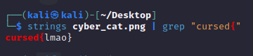

# cyber cat
> i've hidden a flag in this picture of my cat

## About the Challenge
We were given an image (You can downlod the file [here](cyber_cat.png)) and we need to find the flag inside that image

## How to Solve?
To solve this chall, im using `strings` and `grep`. Here is the command I used

```shell
strings cyber_cat.png | grep "cursed{"
```

This command is using the strings command to extract human-readable strings from the file `cyber_cat.png`. Then, it uses the grep command to search for the string `cursed{` in the output of the strings command.



```
cursed{lmao}
```