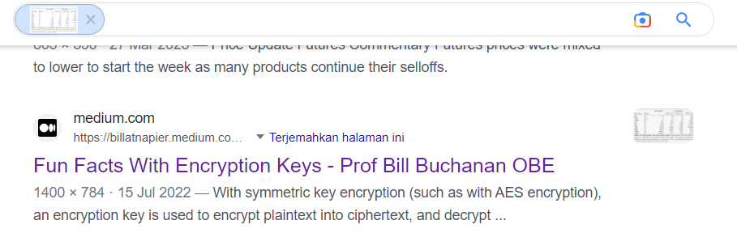

# find the paper
> here is a screenshot from a paper


> here is a screenshot from a paper picture from a paper the flag format is cursed{last name 1, last name 2, ..., last name n}

## About the Challenge
We need to find the author of the paper

## How to Solve?
At first, im using google reverse image and I found this medium post



I opened the blog and found that the screenshot was from a paper titled [Post-quantum RSA](https://cr.yp.to/papers/pqrsa-20170419.pdf).


```
cursed{Lou, Heninger, Bernstein, Valenta}
```