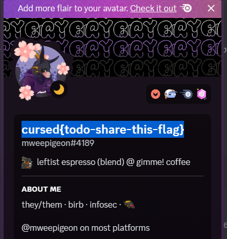

# four
> four

## About the Challenge
> `-`

## How to Solve?
At first, I was really confused because the description was only `four.` However, while searching for 'cursed{' on the Discord server, I found out that one of the admins had used the flag as their username.



```
cursed{todo-share-this-flag}
```