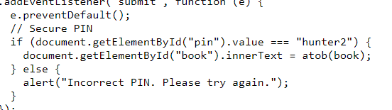
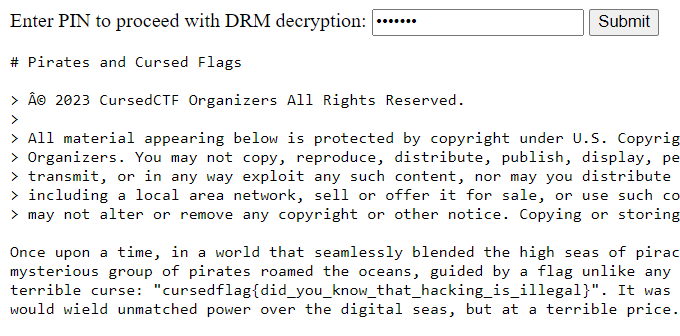

# pirates-and-cursed-flags
> Please don't steal our book. Only authorized users can open this.

## About the Challenge
We were given a html file (You can download the file [here](book.html)) and we need to find the flag there

## How to Solve?
If you check the source code of the website, we know the pin is `hunter2`



Now input `hunter2` in the form and we will obtain the flag



```
cursedflag{did_you_know_that_hacking_is_illegal}
```