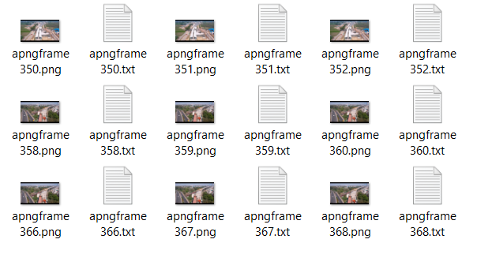
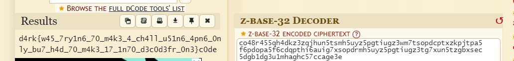

# always painted, never gifted
> A GIF masterpiece that my sister was crafting. However, a mischievous hamster named Hamker sneaked in and disrupted the process, altering the GIF's fundamental structure and adding a few extra frames. Remember, the key to success lies in understanding the base of the problem.

## About the Challenge
We got a very large `apng` file or animated png file and we need to find the flag

## How to Solve?
Because this is an `apng`` file, I attempted to extract every frame using this command

```bash
apngdis lessgo.apng
```



This `apng`` file has 368 frames. If you examine each individual frame, you will notice a strange Pastebin link in frames 229 - 232


Open the url (https://pastebin.com/yvjYJadB), and you will see this message 

```
Lets start the CTF with some easy ones:
 
co48r455qh4dkz3zqjhun5tsmh5uyz5pgtiugz3wm7tsopdcptxzkpjtpa5f6pdopa5f6cdqpthi6auig7xsopdrmh5uyz5pgtiugz3tg7xun5tzgbxsec5dgb1dg3u1mhaghc57ccage3e
```

And then decode it using https://www.dcode.fr/z-base-32-encoding



```
d4rk{w45_7ry1n6_70_m4k3_4_ch4ll_u51n6_4pn6_0nly_bu7_h4d_70_m4k3_17_1n70_d3c0d3fr_0n3}c0de
```