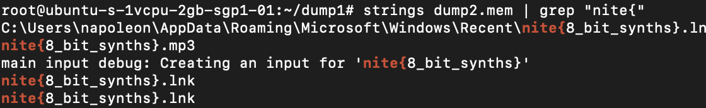

# Amour Plastique
> It seems the intruder likes to hack in style. Analysis reveals the hacker was listening to a playlist while destroying the admin's system. Surely they might have left their tracks. Use dump2 to investigate.

> cheval de troie will be visible after solving this challenge.

## About the Challenge
We were given a dump memory file called `dump2.mem` and we need to find the song that was heard by the hacker

## How to Solve?
In this case im using `strings` and `grep` to get the flag



```
nite{8_bit_synths}
```