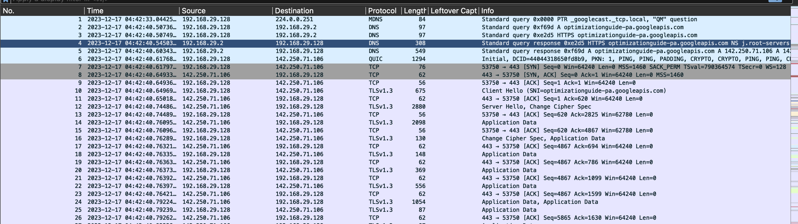
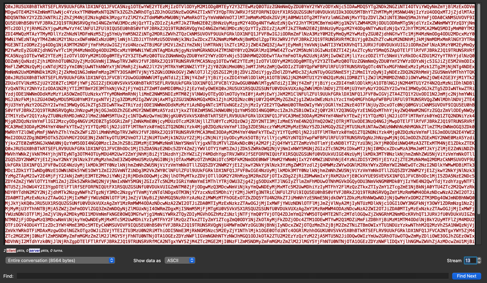
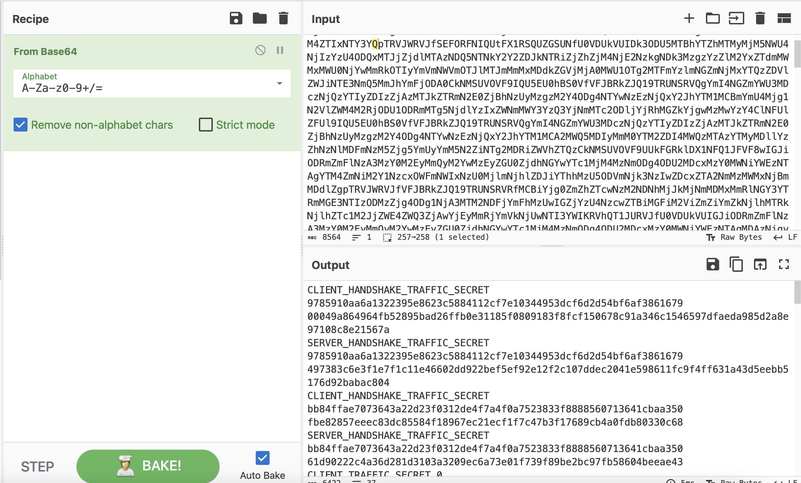
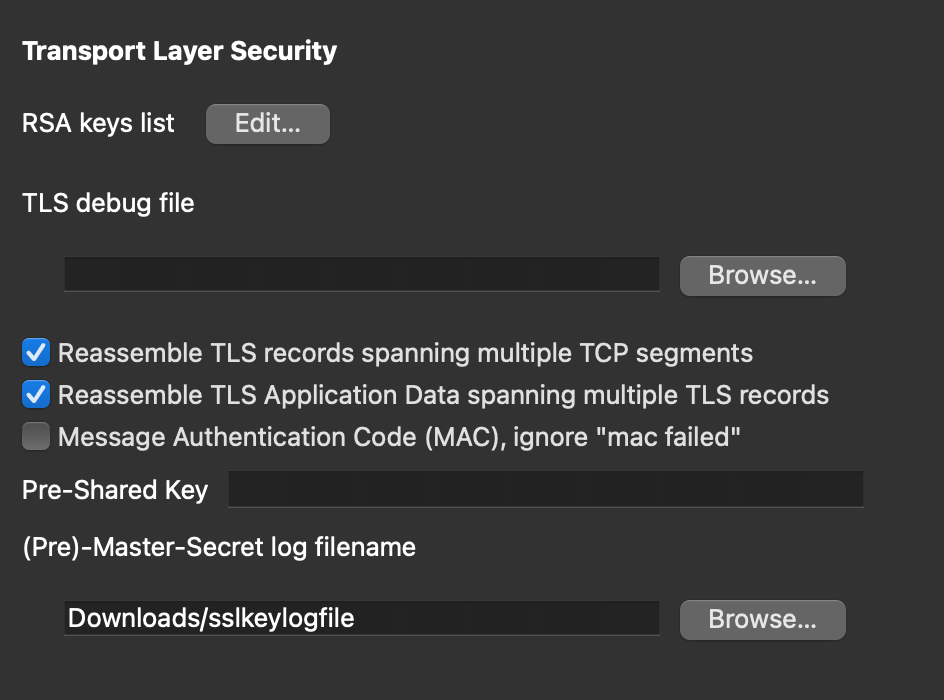
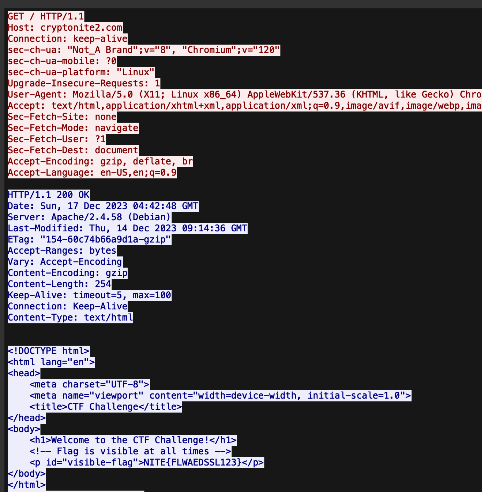

# DecryptaQuest
> Embark on a silent adventure between a web browser and server. No clues, just mystery. Good luck, detective of the unknown!

> "Flag format : NITE{FLAG}"

## About the Challenge
We were given a pcapng file (You can download the file [here](Decryta_logs.pcapng)). The pcapng contains some TLS traffic here
/Users/daffainfo/Downloads/download.log



## How to Solve?
There's an interesting encoded base64 message in stream 13


I copied the msg and then use cyberchef to decode it



This is a `SSLKEYLOGFILE`, this file will be useful to decrypt TLS / SSL traffic in Wireshark. First, save this file and then import it in wireshark



And you can get the flag by checking one of the HTTP request



```
NITE{FLWAEDSSL123}
```