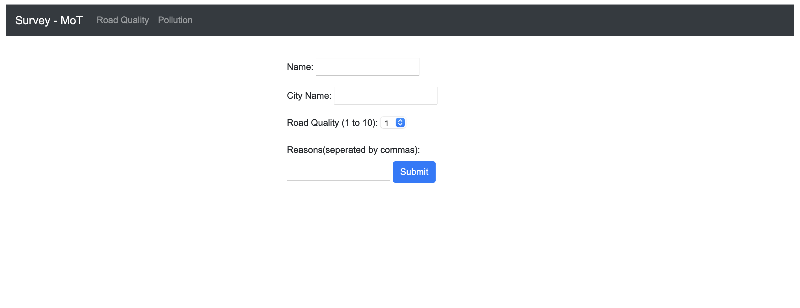
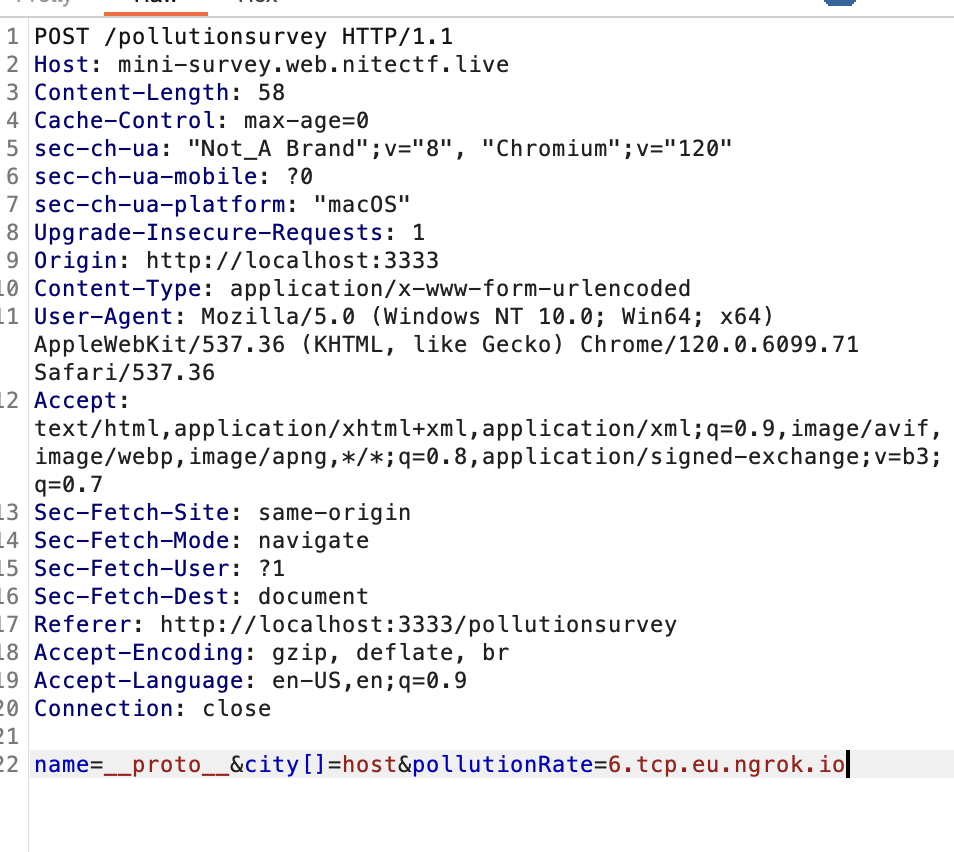
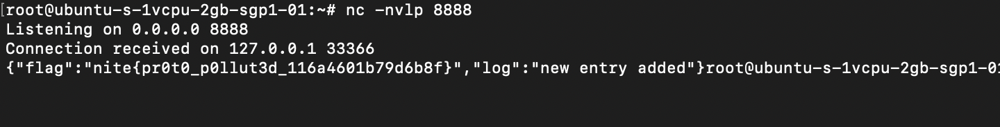

# Mini Survey
> Please answer this survey for the better of all

> - Minnesota Dept of Roads & Railways

## About the Challenge
We were given a website and a source code (You can download the source code [here](miniSurvery_updated_2.zip)). This website has 2 functionality:

* Submit pollution survey
* Submit road quality survey



## How to Solve?
If we look at the source code, the `sendData` function in JavaScript prepares data, configures backup server details, and sends the data to a server. It checks if the server's host ends with ".ngrok.io" and, if true, establishes a TCP connection to the server using the specified host and port. 

```javascript
function sendData(data) {
    const postData = JSON.stringify(data);

    if (data.host != undefined) {
        backupServerHost = data.host;
    }

    if (data.port != undefined) {
        backupServerPort = data.port;
    }

    const options = {
        host: backupServerHost || "localhost",
        port: backupServerPort || "8888",
    };

    if (
        typeof options.host === "string" &&
        options.host.endsWith(".ngrok.io")
    ) {
        const socket = net.connect(options, () => {
            socket.write(postData);
            socket.end();
        });

        socket.on("error", (err) => {
            console.error("Error", err.message);
        });
    }
}
```

So we need to set the `option.host` and `option.port` variable to our ngrok server. But to do that, we need to do prototype pollution first 

```javascript
app.post("/pollutionsurvey", (req, res) => {
    let fieldInput1 = req.body.name;
    let fieldInput2 = req.body.city;
    let fieldInput3 = req.body.pollutionRate;

    surveyOneInitialData[fieldInput1] = { [fieldInput2]: fieldInput3 };

    surveyOneInitialData = updateDBs(surveyOneInitialData, {
        Name: { City: "Rating" },
    });

    res.redirect("/thankyou");
});
```

To do prototype pollution we need to fill `__proto__` in the parameter `name`. Here is the request I sent to the server to set `host` and `port` to our ngrok server



And then check our server again, the flag will be reflected like this



```
nite{pr0t0_p0llut3d_116a4601b79d6b8f}
```