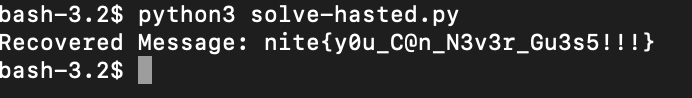

# babyRSA
> RSA in haystack

## About the Challenge
We were given a python script called `encrypt.py` and `output.txt` (You can download the output [here](output.txt)). Here is the content of `encrypt.py`

```python
from Crypto.Util.number import getPrime, bytes_to_long
from secret import FLAG

m = bytes_to_long(FLAG)
f = open ('output.txt', 'w')
e = 37
n = [getPrime(1024)*getPrime(1024) for i in range(e)]
c = [pow(m, e, n[i]) for i in range(e)]

with open ('output.py', 'w'):
    f.write(f"e = {e}\n")
    f.write(f"c = {c}\n")
    f.write(f"n = {n}\n")
```

This RSA encryption is vulnerable to `Hastad Broadcast Attack`

## How to Solve?
In this case i created a script to solve this problem

```python
from Crypto.Util.number import inverse, long_to_bytes
import gmpy2

def hastad_broadcast_attack(e, c, n):
    # Apply Hastad's Broadcast Attack
    M = 1
    for modulus in n:
        M *= modulus

    result = 0
    for i in range(len(n)):
        Mi = M // n[i]
        Mi_inv = inverse(Mi, n[i])
        result += c[i] * Mi * Mi_inv

    result = result % M

    # Use gmpy2 for nth root
    m = int(gmpy2.iroot(result, e)[0])

    return long_to_bytes(m)

# Load the values from the file
with open('output.txt', 'r') as f:
    exec(f.read())

# Perform the Hastad's Broadcast Attack
recovered_message = hastad_broadcast_attack(e, c, n)
print("Recovered Message:", recovered_message.decode())
```

Run the program and voilà!



```
nite{y0u_C@n_N3v3r_Gu3s5!!!}
```