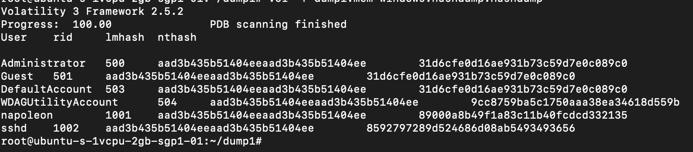
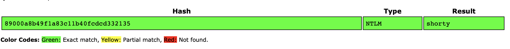

# conqueror
> Our company is dealing with a possible case of corporate espionage. The credentials of one of our systems were changed and it was used to gain access to our internal network.

> Help us gain access to the system before its too late.

> Memory Dump Link: https://drive.google.com/file/d/14MWp-UtVPAcu1hEyv1_xBhpdO3nIrEBo/view?usp=sharing

> Flag Format: nite{user_password}

> coup de réseau will be visible after solving this challenge.

## About the Challenge
We were given a memory dump file and we need to get the user and password

## How to Solve?
To solve this challenge, we can use `volatility3` and then run this command to dump the user and the MD5 hash.

```bash
vol -f dump1.mem windows.hashdump.Hashdump
```



Crack the MD5 hash using bruteforce attack, or you can try to put these hashes into cracker online like https://crackstation.net



```
nite{napoleon_shorty}
```