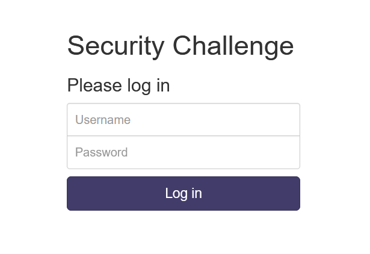
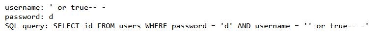
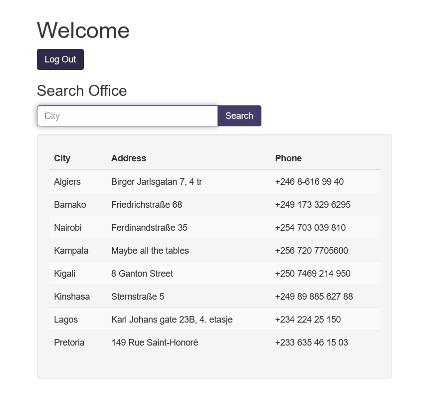
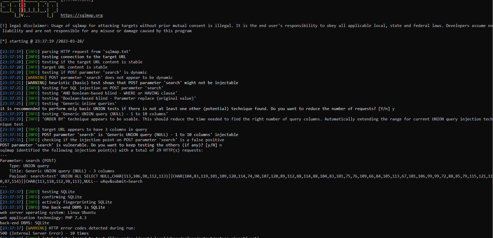
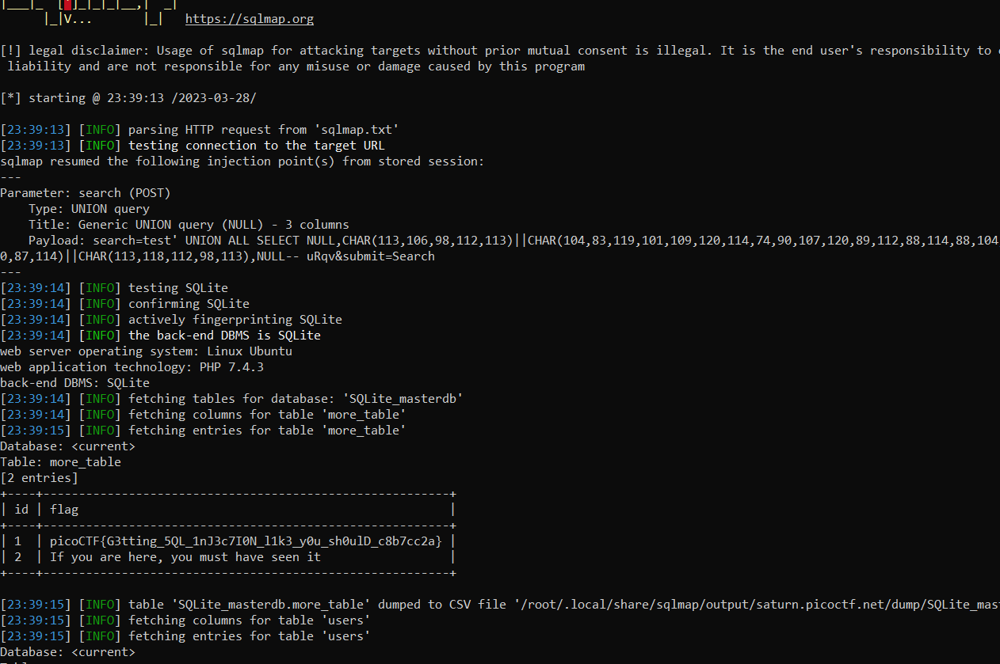

# More SQLi
> Can you find the flag on this website.

## About the Challenge
We were given a simple website that contains login form, here is the preview of the website



## How to Solve?
If you found a login form on the CTF competition, the need to check if the form is vulnerable to SQL injection. So I tried to input this into the login form

```
Username: ' or true-- -
Password: d
```

And the output is



We still can't log into the dashboard, but we can see the query running on the login form. So to bypass the login form, we need to input `' or true-- -` in the password form



As you can see we can login into an admin dashboard and then there is a search form. And of course we need to do SQL injection again in the search form to obtain the flag. In this case i'll be using SQLMap to exploit the vulnerability



As you can see the SQLMap detect the `search` parameter is vulnerable to SQL injection. And to obtain the flag we need to dump the database using `--dump` switches



```
picoCTF{G3tting_5QL_1nJ3c7I0N_l1k3_y0u_sh0ulD_c8b7cc2a}
```