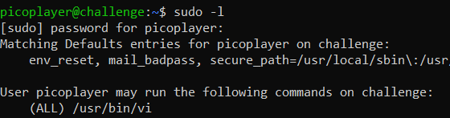
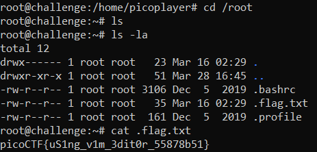

# Permissions
> Can you read files in the root file?

## About the Challenge
We were given an access to SSH server and then we need to read the flag in the `root` directory

## How to Solve?
If we check the `sudo` configuration



There are only 1 commands that we can use, `/usr/bin/vi`. In this case we will be using `/usr/bin/vi` command to do privilege escalation (Im using [GTFOBins](https://gtfobins.github.io/gtfobins/vi/#sudo) to do privilege escalation)


And then go to `/root` directory and read `.flag.txt` to obtain the flag



```
picoCTF{uS1ng_v1m_3dit0r_55878b51}
```