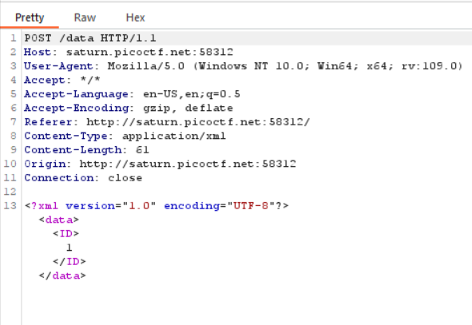
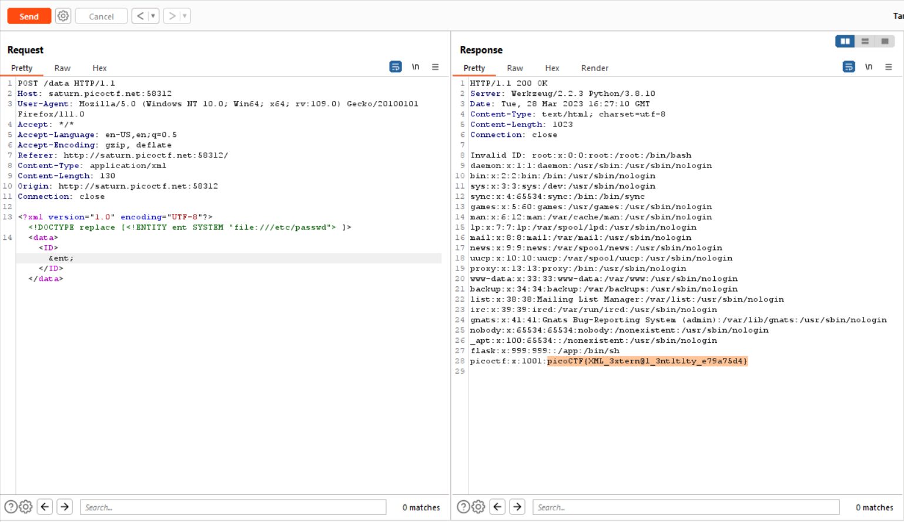

# SOAP
> The web project was rushed and no security assessment was done. Can you read the /etc/passwd file?

## About the Challenge
We were given a simple website, here is the preview of the website


## How to Solve?
If we press `Details`, we will see this HTTP request



The first thing that comes to my mind is XXE vulnerability. So as the chall says, we need to read `/etc/passwd` file to obtain the flag. 

Im using this GitHub repository to find the correct payload (You can check the repo [here](https://github.com/payloadbox/xxe-injection-payload-list)) And here is the HTTP request to read `/etc/passwd` file



```
picoCTF{XML_3xtern@l_3nt1t1ty_e79a75d4}
```