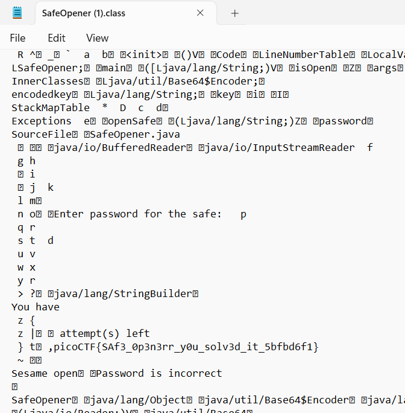

# Safe Opener 2
> What can you do with this file?

> I forgot the key to my safe but this file is supposed to help me with retrieving the lost key. Can you help me unlock my safe?

## About the Challenge
We were given a file called `SafeOpener.class` (You can download the file [here](SafeOpener.class)) and we need to find the flag inside the file

## How to Solve?
It's easy, just open the file using your lovely text editor and you will see the flag



```
picoCTF{SAf3_0p3n3rr_y0u_solv3d_it_5bfbd6f1}
```