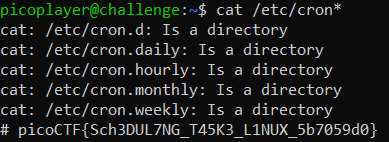

# chrono
> How to automate tasks to run at intervals on linux servers?

## About the Challenge
We were given an access to SSH server and then we need to find the flag in the server

## How to Solve?
If we read the description of the flag, we can assume the flag was located on the cron file, so to solve this chall im using this command

```
cat /etc/cron*
```

This command will read any file that start with `cron`. And here is the output



```
picoCTF{Sch3DUL7NG_T45K3_L1NUX_5b7059d0}
```