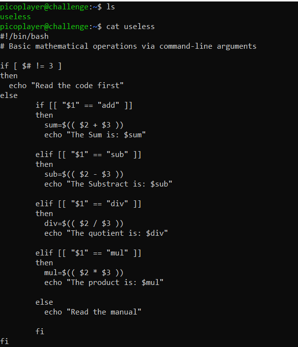
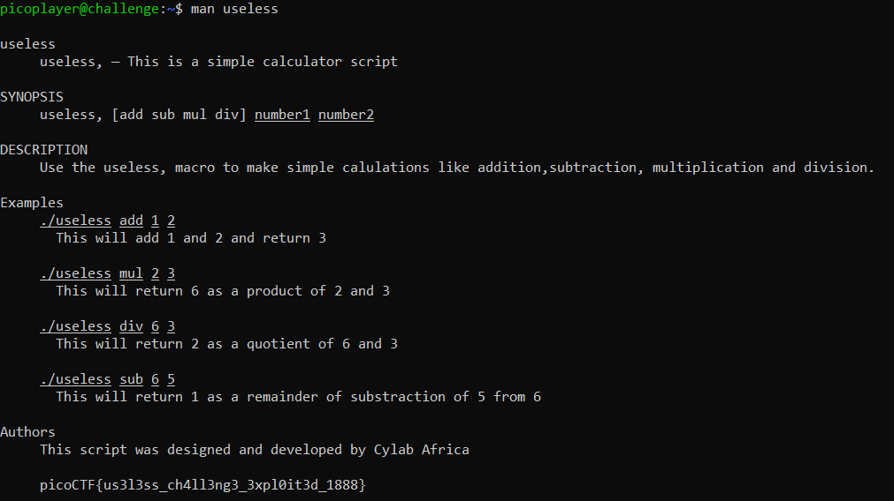

# useless
> There's an interesting script in the user's home directory

## About the Challenge
We were given an access to SSH server and then there is a file called `useless` and if we check the content of the file



## How to Solve?
If we check the source code of the `useless` file, in the `else` block there is a hint. To obtain the flag, we need to read the manual of the file. So im using this command

```shell
man useless
```

Here is the output



```
picoCTF{us3l3ss_ch4ll3ng3_3xpl0it3d_1888}
```