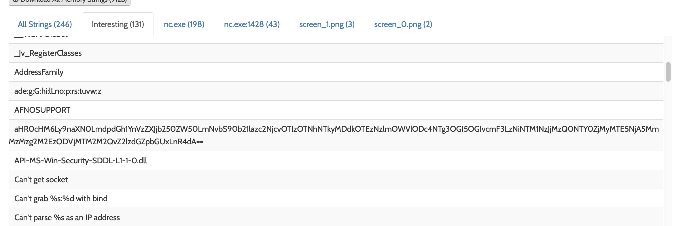
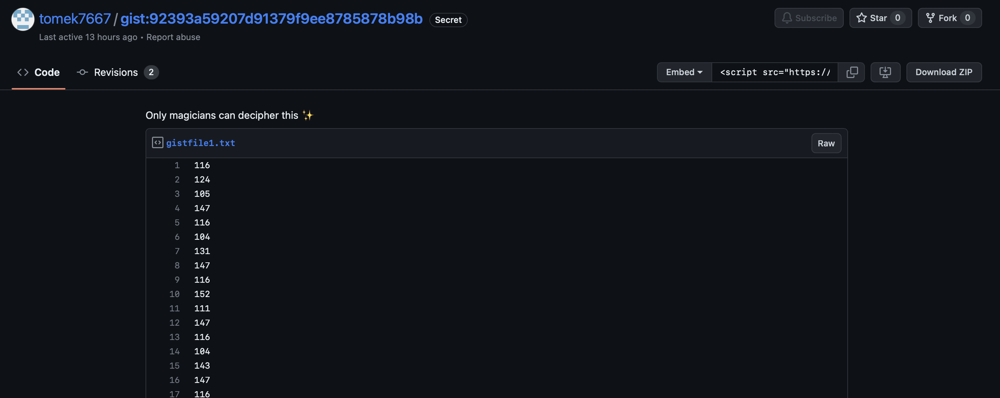
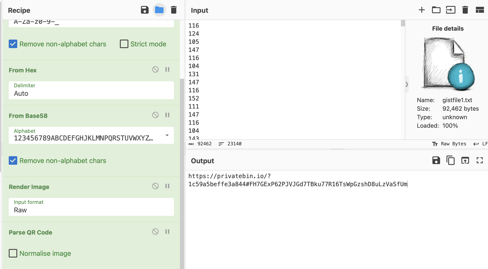
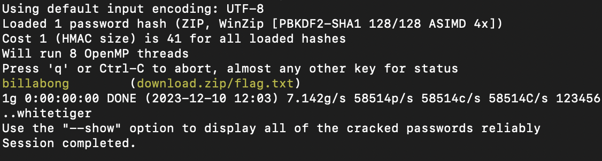

# internet-cat
> I heard that there are is no official nc for windows and I love this OS! Fortunately, my black hat hacker colleague has sent me his forged copy that he intercepted from other hackers which have intercepted it from others and that from others... I don't know how many times it was intercepted but it works! I have tested it on my Windows 10 and it works like a charm!

## About the Challenge
We were given a file called `80295df3cfa79de08064ddffed0deff5.zip` (You can download the file [here](880295df3cfa79de08064ddffed0deff5.zip)). Here is the preview of the program

## How to Solve?
If you upload the file to an online malware sandbox (in this case, I am using https://www.hybrid-analysis.com/), you will receive a base64 string.



Decode it using `base64` encoding and you'll get a GitHub gist

```
https://gist.github.com/tomek7667/92393a59207d91379f9ee8785878b98b/e3dc6bb2fed39c0f9d3a74b30af09394174ef78c
```

If you open the GitHub gist, you'll see `Nothing to see here, move along.` msg. But there are 2 revisions here, open the first revision and you'll get a list of numbers



And then upload to cyberchef and then use this options:
* Octal
* Base64
* Hex
* Base58
* Render Image
* Parse QR Code

And you'll get another URL



Open the URL and you got another string

```
UEsDBBQACQBjABpciVcFV6wiRQAAACcAAAAIAAsAZmxhZy50eHQBmQcAAQBBRQMIAOqNoUX0Z5cij1J6uViuJOT+jLbo0Tibnbs0x++zz1pfItBmkkebOjEsVMVAxWFcUO8yYdA4CXgjEECKzi+mBqdI+rjACFBLBwgFV6wiRQAAACcAAABQSwECHwAUAAkAYwAaXIlXBVesIkUAAAAnAAAACAAvAAAAAAAAACAIAAAAAAAAZmxhZy50eHQKACAAAAAAAAEAGAATmwIRiyraARObAhGLKtoBNqEVIIcq2gEBmQcAAQBBRQMIAFBLBQYAAAAAAQABAGUAAACGAAAAAAA=
```

Decode it again using `base64` encoding and you will receive a password-protected zip file. Crack it using john



Enter the password and voilà!

```
ping{u_w4nt3d_f0r3n51C5_4nD_y0u_g0t_17}
```