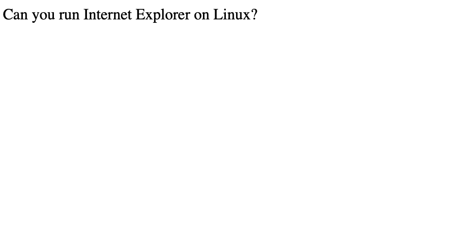
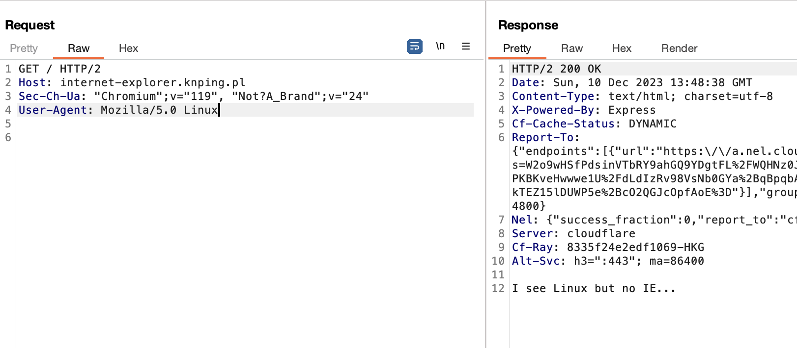
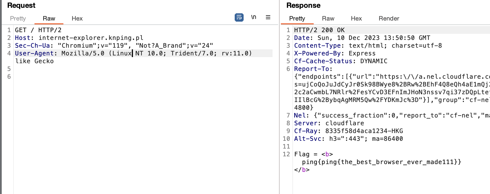

# internet-explorer
> Can you run Internet Explorer on Linux?

## About the Challenge
We were given a website without the source code, and this is what the website looks like



## How to Solve?
At first I tried to change the `User-Agent` header from `Windows` to `Linux` and I got another response:



So I googled and found a correct header for Internet Explorer in Linux



```
ping{ping{the_best_browser_ever_made111}}
```