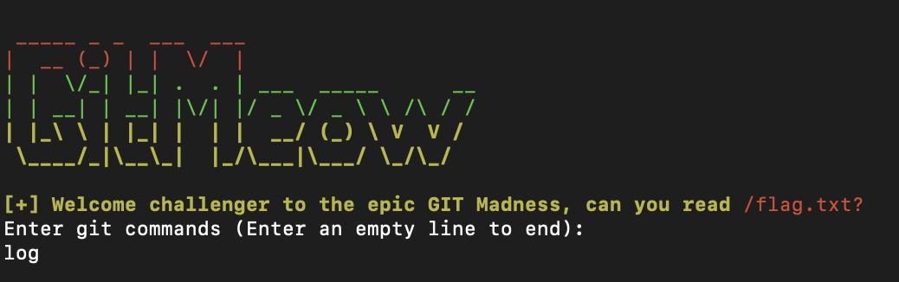
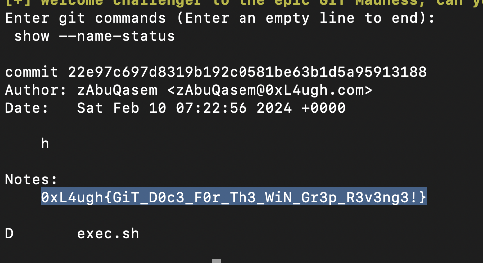

# GitMeow-Revenge
> Just another annoying git challenge, without grep :)

> Updated blacklist on remote server

> BLACKLIST = ["|", "\"", "'", ";", "$", "\\", "#", "*", "(", ")", "&", "^", "@", "!", "<", ">", "%", ":", ",", "?", "{", "}", "`","diff","/dev/null","patch","./","alias","push","grep","f4k3","fl4g","f0r","n00b5","flag","work"]

## About the Challenge
We got a server to connect and source code (You can download the source code [here](gitmeow-misc.zip)). If we check the source code:

```python
import os
from banner import monkey

BLACKLIST = ["|", "\"", "'", ";", "$", "\\", "#", "*", "(", ")", "&", "^", "@", "!", "<", ">", "%", ":", ",", "?", "{", "}", "`","diff","/dev/null","patch","./","alias","push","grep","f4k3","fl4g","f0r","n00b5","flag","work"]

def is_valid_utf8(text):
    try:
        text.encode('utf-8').decode('utf-8')
        return True
    except UnicodeDecodeError:
        return False

def get_git_commands():
    commands = []
    print("Enter git commands (Enter an empty line to end):")
    while True:
        try:
            user_input = input("")
        except (EOFError, KeyboardInterrupt):
            break

        if not user_input:
            break

        if not is_valid_utf8(user_input):
            print(monkey)
            exit(1337)

        for command in user_input.split(" "):
            for blacklist in BLACKLIST:
                if blacklist in command:
                    print(monkey)
                    exit(1337)
            

        commands.append("git " + user_input)

    return commands

def execute_git_commands(commands):
    for command in commands:
        output = os.popen(command).read()
        if "{f4k3_fl4g_f0r_n00b5}" in output:
            print(monkey)
            exit(1337)
        else:
            print(output)
            


commands = get_git_commands()
execute_git_commands(commands)
```

We only need to obtain the flag using the git command



## How to Solve?
In this case im using `git show --name-status` command in order to read the flag (I believe this is unintended, because someone already put the flag in the commit)



```
0xL4ugh{GiT_D0c3_F0r_Th3_WiN_Gr3p_R3v3ng3!}
```