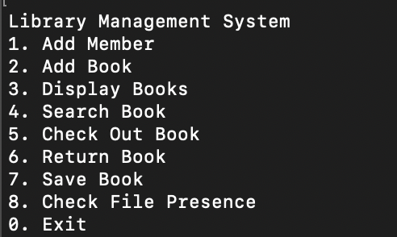
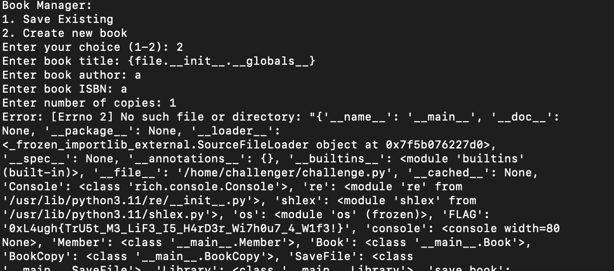

# Library-Revenge
> Built a book library, however my friend says that i made a really nasty mistake!

## About the Challenge
We got a server to connect and a source code (You can download the source code [here](Library-revenge-misc.zip))

This program has many functions. For example, we can add a member, search for a book, etc



## How to Solve?
This program is vulnerable to format string vulnerability where we can access other attributes (You can check more about the vulnerability [here](https://podalirius.net/en/articles/python-format-string-vulnerabilities/))

```python
        elif choice == "7":
            choice = console.input("\n[bold blue]Book Manager:[/bold blue]\n1. Save Existing\n2. Create new book\n[bold blue]Enter your choice (1-2): [/bold blue]")
            if choice == "1":
                title = console.input("[bold blue]Enter Book title to save: [/bold blue]").strip()
                file = SaveFile(library.display_books(title=title))
                save_book(file.file, content="Hello World")
            else:
                save_file = SaveFile()
                title = console.input("[bold blue]Enter book title: [/bold blue]").strip()
                author = console.input("[bold blue]Enter book author: [/bold blue]")
                isbn = console.input("[bold blue]Enter book ISBN: [/bold blue]")
                num_copies = int(console.input("[bold blue]Enter number of copies: [/bold blue]"))
                title = title.format(file=save_file)
                book = Book(title,author, isbn)
                isbn_to_book[isbn] = book
                library.add_book(book, num_copies)
                save_book(title)
```

So, if we input `{file.__init__.__globals__}` in the book title, we can read the value of the `FLAG` variable.



```
0xL4ugh{TrU5t_M3_LiF3_I5_H4rD3r_Wi7h0u7_4_W1f3!}
```