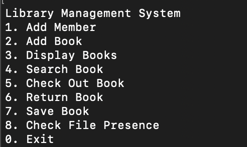
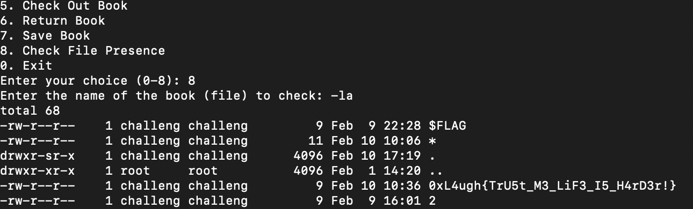

# Library
> Built a book library, however my friend says that i made a nasty mistake!

## About the Challenge
We got a server to connect and a source code (You can download the source code [here](Library-misc.zip))

This program has many functions. For example, we can add a member, search for a book, etc



## How to Solve?
This website is vulnerable to argument injection in the `check_file_presence()` function, and there's a `print(result)` code, so we can see the command output here

```python
def check_file_presence():
    book_name = shlex.quote(console.input("[bold blue]Enter the name of the book (file) to check:[/bold blue] "))
    command = "ls " + book_name

    try:
        result = os.popen(command).read().strip()
        print(result)
        if result == book_name:
            console.print(f"[bold green]The book is present in the current directory.[/bold green]")
        else:
            console.print(f"[bold red]The book is not found in the current directory.[/bold red]")
    except Exception as e:
        console.print(f"[bold red]Error: {e}[/bold red]")
```

To obtain the flag I just using `-la` command (I believe this is unintended because someone has already placed the flag in the same directory as this program)



```
0xL4ugh{TrU5t_M3_LiF3_I5_H4rD3r!}
```