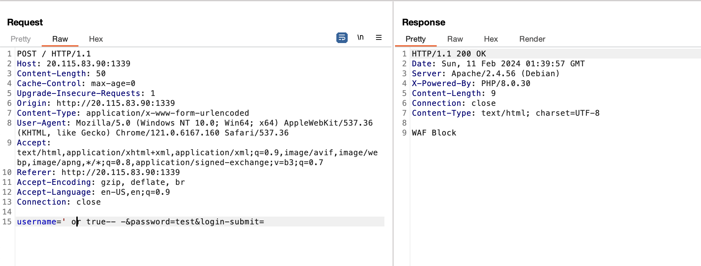
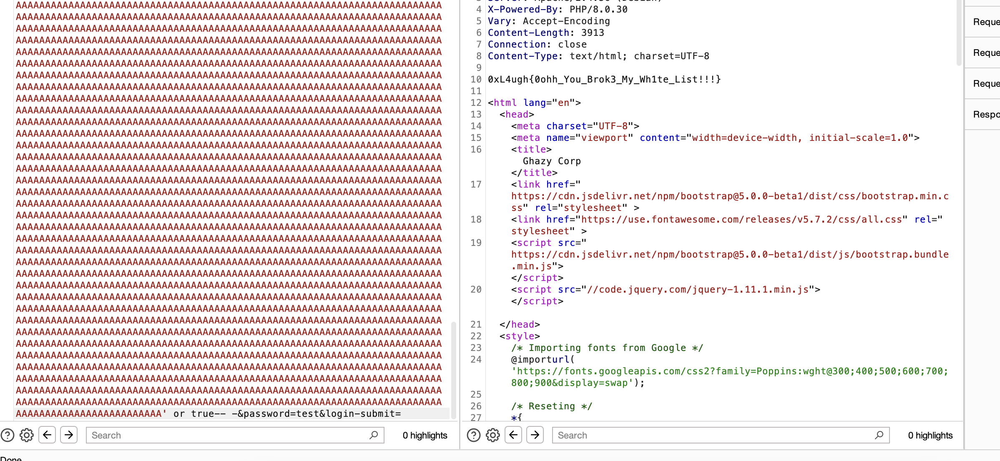

# Simple WAF
> i whitelisted input values so, i think iam safe : P

## About the Challenge
We got a website and the source code (You can download the source code [here](simple_waf_togive.zip)). The source code is pretty simple:

```php
require_once("db.php");

function waf($input)
{
    if(preg_match("/([^a-z])+/s",$input))
    {
        return true;
    }
    else
    {
        return false;
    }
}


if(isset($_POST['login-submit']))
{
	if(!empty($_POST['username'])&&!empty($_POST['password']))
	{
        $username=$_POST['username'];
		$password=md5($_POST['password']);
        if(waf($username))
        {
            die("WAF Block");
        }
        else
        {
            $res = $conn->query("select * from users where username='$username' and password='$password'");
                                                                    
            if($res->num_rows ===1)
            {
                echo "0xL4ugh{Fake_Flag}";
            }
            else
            {
                echo "<script>alert('Wrong Creds')</script>";
            }
    }

	}
	else
	{
		echo "<script>alert('Please Fill All Fields')</script>";
	}
}
```

This website is vulnerable to SQL injection, but there's a waf() function that we need to bypass in order to perform SQL injection



## How to Solve?
We need to overflow the `preg_match` function by supplying a lot of characters, followed by an SQL injection payload (e.g., `' or true-- -`)



```
0xL4ugh{0ohh_You_Brok3_My_Wh1te_List!!!}
```