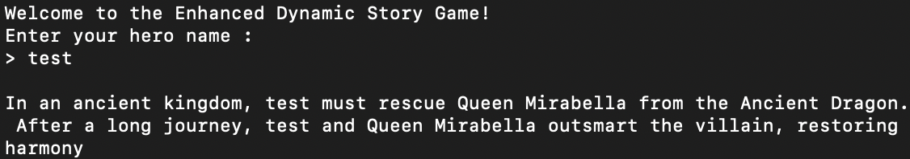
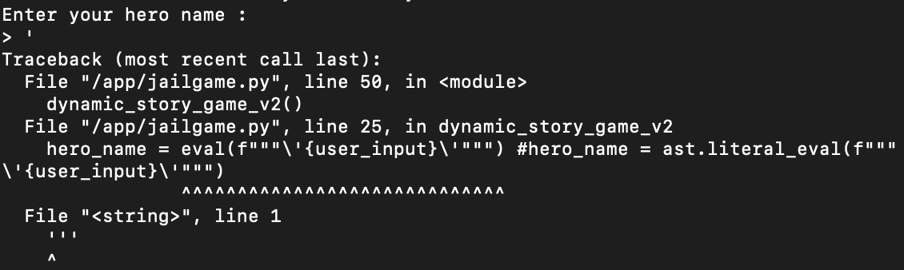
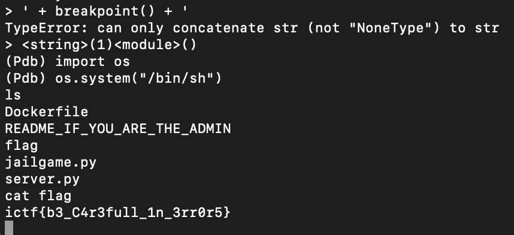

# Fairy Tale
> Type in your favorite hero and let Fairy Tale spin a unique story for you.

## About the Challenge
We got a server to connect without a source. Here is the preview of the challenge



If we try to input `'`, we'll get an error message like this:



It seems like our input is being passed into the `ast.literal_eval()` function

## How to Solve?
To solve this chall, im calling `breakpoint()` function and then call `/bin/sh` by importing `os` package

```
' + breakpoint() + '
```



```
ictf{b3_C4r3full_1n_3rr0r5}
```