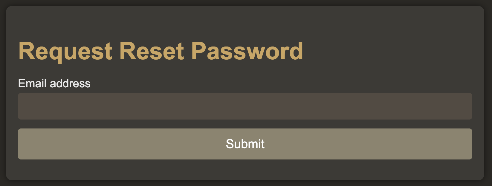
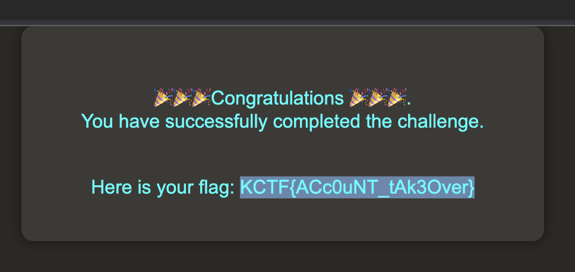

# Gain Access 1
> The web challenges are very much similar to real life application bugs. This is going to be a series of Gain Access with 3 challenges unlocks upon solving one by one. By solving these challenges, you'll gain a practical knowledge of Authentication Bypass Vulnerabilites as well as business logic error. The only difference is you'll not get any bounty but you'll get flags. Give it a try. And keep in mind, Don't make it hard, keep it simple. All the best. Solve the challenges & be a cyber knight.

## About the Challenge
We got a website without the source code, and there are 2 functions here. First, we can login using an email and password


And then there's another function where we can reset a user password using an email



## How to Solve?
The login feature is vulnerable to SQL injection, to bypass the login page we need to input this username and password:

```
U: ' or true-- -
P: test
```



```
KCTF{ACc0uNT_tAk3Over}
```