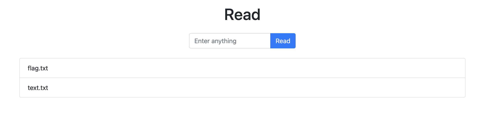
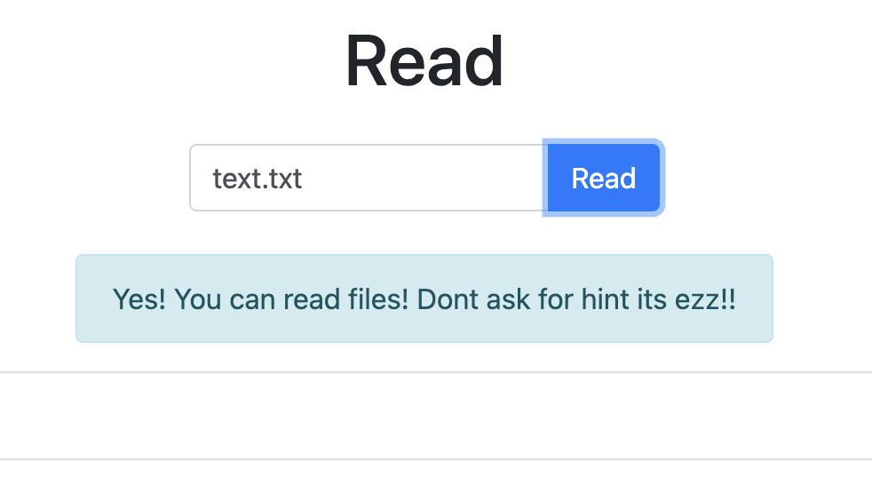
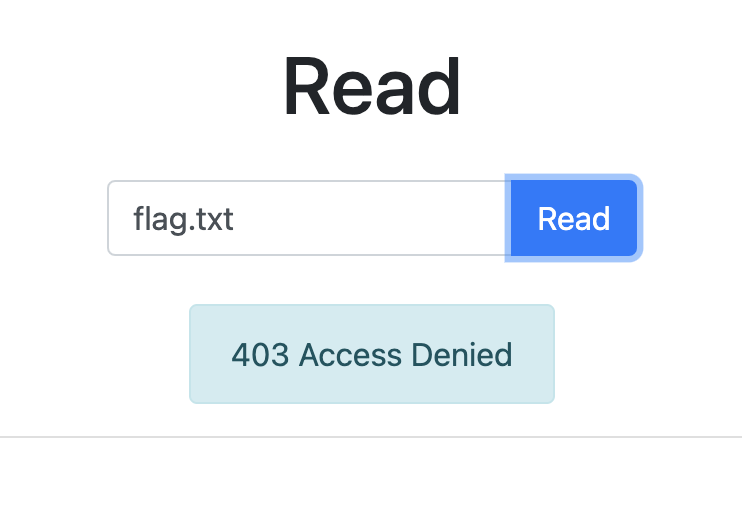
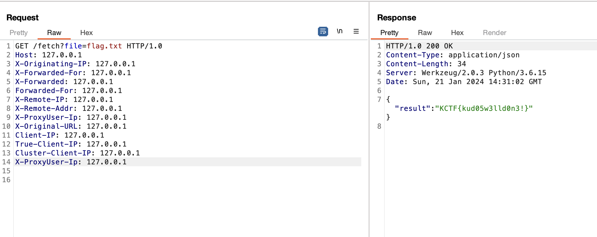

# README
> Read me if you can!!

## About the Challenge
We got a website without the source code, and on this website, we need to read the `flag.txt` file to obtain the flag.



In this case, we can't directly read the `flag.txt` file. Instead, we can only read the `text.txt` file.





## How to Solve?
At first, I thought we need to read the flag using a Path Traversal vulnerability. However, in order to access the flag, we must first bypass the 403 restriction by adding an HTTP proxy header



```
KCTF{kud05w3lld0n3!}
```