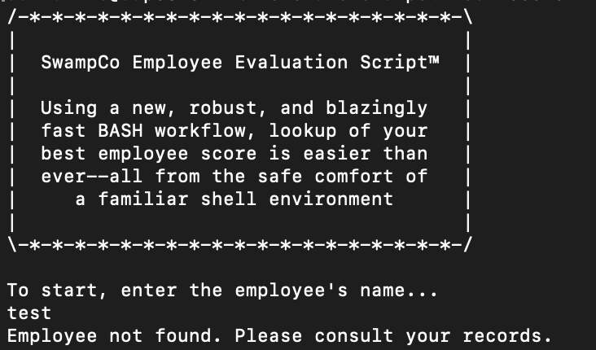
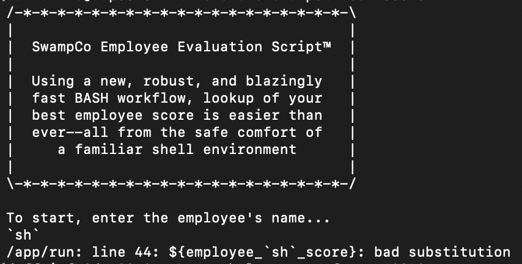
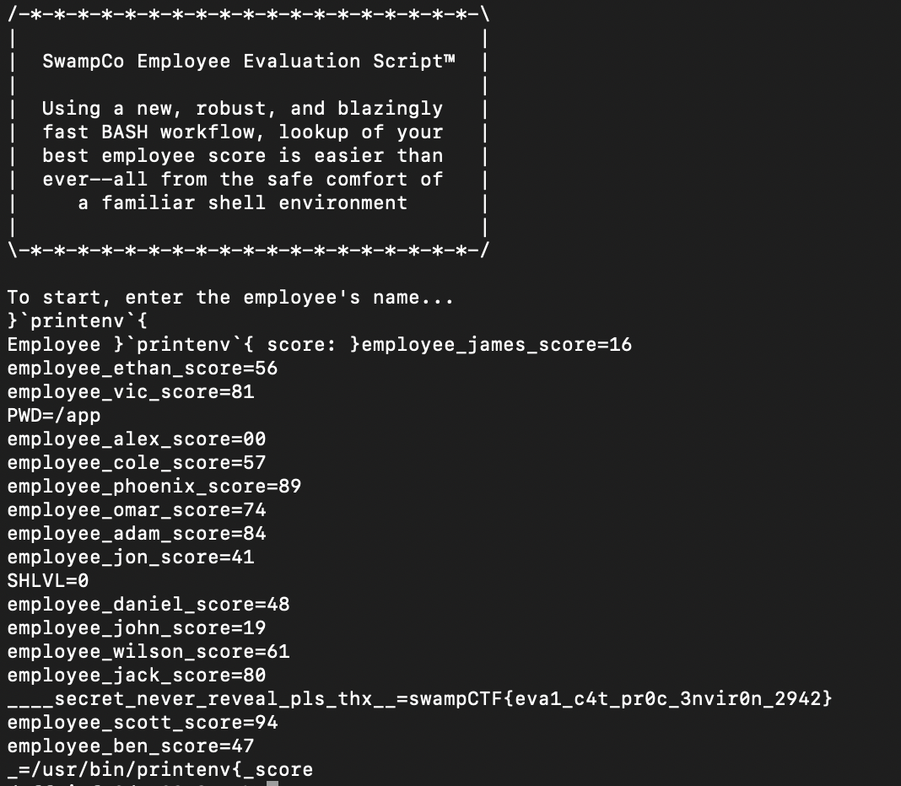

# Employee Evaluation
> This company sucks. They're ranking all the employees against one another, and they keep putting security to the sideline. The CISO told me that they don't care about actual code quality, just fancy buzzwords and looking nice. I want to get out of here, but I can't without this dang secret code. It's for, uh, good things, and not sharing secrets. This exposed evaluation script seems like a good start. Can you help me out?

## About the Challenge
We got a server to connect, here is a preview of the challenge



The first thing that comes to my mind is `bash jail`

## How to Solve?
At first I tried to use `ls` payload and here was the result



It looks like we need to close the curly brackets first and then execute an OS command. In this case, the flag was located in env variables



```
swampCTF{eva1_c4t_pr0c_3nvir0n_2942}
```