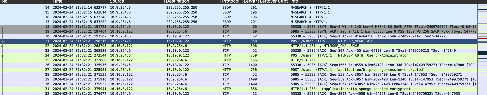
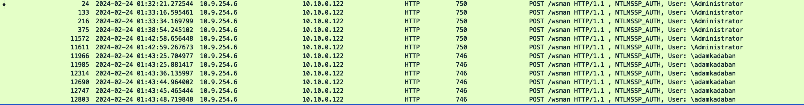

# Notoriously Tricky Login Mess (Part 1)
> We found out a user account has been compromised on our network. We took a packet capture of the time that we believe the remote login happened. Can you find out what the username of the compromised account is?

> swampCTF{username}

## About the Challenge
We got a `pcapng` file that contains winrm traffic



## How to Solve?
To solve this chall, im using `http` filter and then sort by `info`



As we can see, there are 2 users (Administrator and adamkadaban)

```
swampCTF{adamkadaban}
```