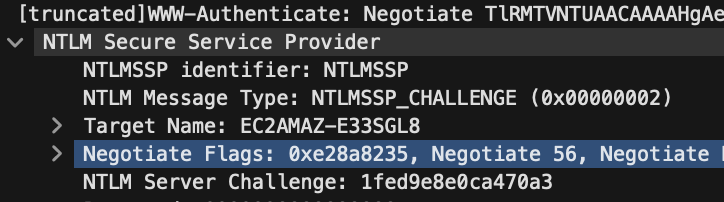

# Notoriously Tricky Login Mess (Part 2)
> Great job finding the username! We want to find out the password of the account now to see how it was so easily breached. Can you help?

## About the Challenge
Now, we need to find `adamkadaban` password

## How to Solve?
To solve this chall, im using this [blog](https://web.archive.org/web/20200930000459/https://www.root9b.com/newsroom/attacking-windows-fallback-authentication/) as a reference. First we need to build the ntlmv2 hash first, here is formula:

```
{Username}::{Hostname}:{Server Challenge}:{NTProofstr}{NTLMv2 Response}
```

* Username:

We already got the username which is `adamkadaban`

* Hostname:

null

* Server Challenge



* NTProofstr


* NTLMv2 Response


Now combine every part you have already found, and then crack it using hashcat.

```
ADAMKADABAN:::1fed9e8e0ca470a3:98ebffae0b77865893846dfadb757cfb:0101000000000000801c50dbc266da0188d48d08eff230a80000000002001e0045004300320041004d0041005a002d00450033003300530047004c00380001001e0045004300320041004d0041005a002d00450033003300530047004c00380004001e0045004300320041004d0041005a002d00450033003300530047004c00380003001e0045004300320041004d0041005a002d00450033003300530047004c003800070008005783ebd6c266da010000000000000000
```

```
hashcat -m 5600 -a 0 hash.txt /usr/share/wordlists/rockyou.txt
```

```
swampCTF{emilyyoudontknowmypassword}
```