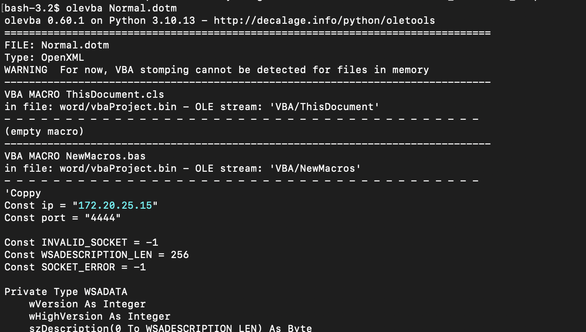
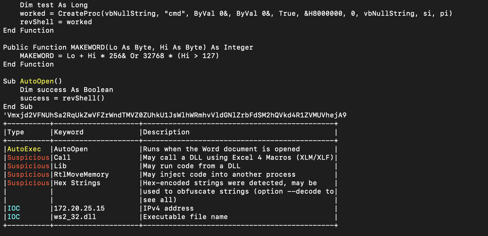
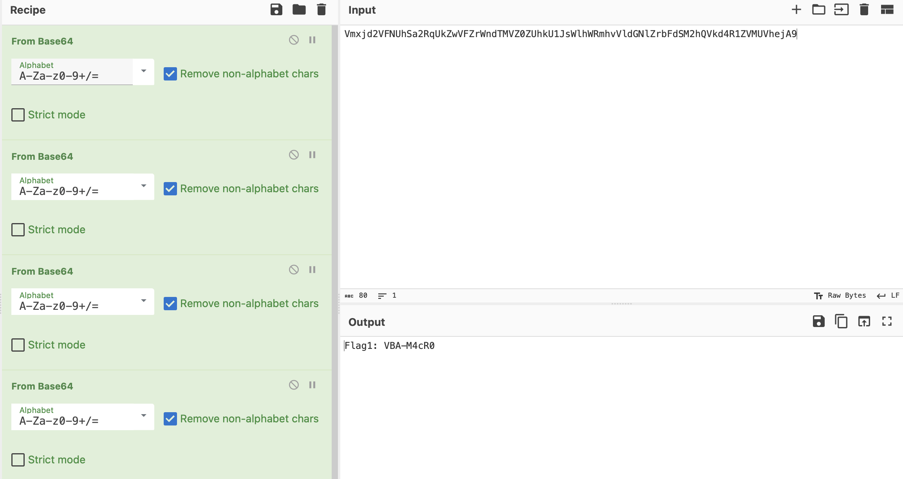
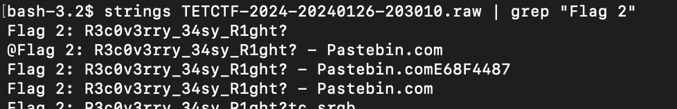

# TET & 4N6
> Tet is coming, TetCTF is coming again. Like every year, I continued to register to play CTF, read the rules to prepare for the competition. After reading the rules, my computer seemed unusual, it seemed like it was infected with malicious code somewhere. Can you find out?
> Find the malicious code and tell me the IP and Port C2
> What was the first flag you found?
> After registering an account, I no longer remember anything about my account. Can you help me find and get the second flag?
> Format : TetCTF{IP:Port_Flag1_Flag2}

> Ex: TetCTF{1.1.1.1:1234_Hello_HappyForensics}

## About the Challenge
We got 2 files, `Backup.ad1` and `TETCTF-2024-20240126-203010.raw` and we need to find the malicious code, first flag, and the second flag from these 2 forensic artefacts

## How to Solve?

First, we need to find the malicious code. If we open the `Backup.ad1` file using FTK Imager and go to `Roaming/Microsoft/Windows/`, you will find a dotm file.

And if you run `olevba` you will get the ip, port, and the first flag



And it the end of the VBA script, there is a Base64 encoded msg





And I managed to get the second flag using `strings` and `grep`

```
strings TETCTF-2024-20240126-203010.raw | grep "Flag 2"
```



```
TetCTF{172.20.25.15:4444_VBA-M4cR0_R3c0v3rry_34sy_R1ght?}
```